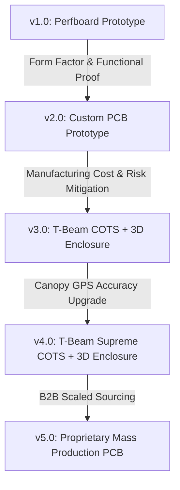

# TrekLink Roadmap Analysis & Development Phase Pivot (v2.0 → v3.0 → v4.0)

This document evaluates the strategic pivot from the current custom-designed v2.0 prototype to Commercial Off-The-Shelf (COTS) module-based architectures (v3.0 T-Beam and v4.0 T-Beam Supreme) inside custom 3D-printed enclosures running branded Meshtastic firmware.

---

## 1. Architectural Evolution

The transition across versions represents a shift in focus from **hardware-level validation** to **operational deployment & cost optimization**:



### Comparative Analysis: Custom PCB vs. COTS Modules

| Parameter | v2.0 (Custom PCB Prototype) | v3.0 (LILYGO T-Beam V1.1/V1.2) | v4.0 (LILYGO T-Beam Supreme) |
|---|---|---|---|
| **Core Processor** | ESP32-S3-WROOM-1 (N8R8) | Legacy ESP32-D0WDQ6 | ESP32-S3-WROOM-1 (N8R8) |
| **LoRa Radio** | E22-400M22S (SX1268, 1W) | E22-900T22D / SX1276 / SX1278 | SX1262 (+22 dBm) |
| **GNSS (GPS)** | NEO-M9N (Multi-constellation) | NEO-6M / NEO-M8N (Single-constellation) | u-blox MAX-M10S (L1/L5, Quad-const) |
| **Power Efficiency** | Medium (3.3V switching regulator) | Low (Legacy dual-core, high idle drain) | High (Optimized S3 PMU sleep states) |
| **SAR Performance** | Excellent canopy tracking | Poor (NEO-6M suffers high drift in woods) | Best-in-class (MAX-M10S maintains sub-5m lock) |
| **Unit Hardware Cost** | High (~$75+ in low-volume prototype) | Low (~$25 - $30) | Medium (~$35 - $45) |
| **Production Risk** | High (Layout, EMI, assembly failure rate) | Zero (Pre-built, pre-certified RF) | Zero (Pre-built, pre-certified RF) |

---

## 2. Technical Evaluation of the Pivot

### A. The Case for the Pivot (v2.0 → v3.0/v4.0)
*   **De-risking RF & GNSS Tuning:** Custom RF layout (50Ω trace impedance matching, IPEX pigtail routing, ground planes) carries high risk of signal loss or noise coupling. Using LILYGO modules completely bypasses these RF layout vulnerabilities.
*   **Regulatory Certification Exemption:** LILYGO boards carry FCC/CE modular certifications. Commercializing a product based on pre-certified modules is faster and cheaper than certifying a fully custom board.
*   **Rapid Enclosure Prototyping:** Standardizing on the T-Beam form factor opens access to existing open-source 3D-printable cases, which can be modified to fit the dual 21700 battery pack.

### B. The Pitfalls & Tradeoffs
*   **Mechanical Dimension Constraints:** LILYGO T-Beam boards are long and narrow (~100 mm × 32 mm) compared to our compact, square v2.0 design (52.5 mm × 70.0 mm). Enclosures will be elongated, affecting ergonomics.
*   **Battery Mod Challenges:** The T-Beam comes pre-soldered with an 18650 plastic battery tray on the back. Upgrading to a 21700 battery requires desoldering the rigid steel structural pins of the 18650 holder, which can damage the board if done without proper heat control, or running external leads from a wired 21700 tray.

---

## 3. Firmware Customization & Branding (Meshtastic)

To display a custom name (e.g., **"TrekLink"**) and logo on the boot/splash screen, the firmware must be modified at the source level.

### A. Code modification hotspots in Meshtastic firmware
In the [Meshtastic Firmware Repository](https://github.com/meshtastic/firmware):
1.  **Splash Screen Logo:** Locate the graphics assets (typically in `src/graphics/` or `src/screen/`). The Meshtastic logo is stored as a monochrome bitmap array (XBM format or raw hex bytes). Replace this array with the TrekLink logo.
2.  **Boot Text:** Modify the initialization routines in `Screen.cpp` or `graphics.cpp` to replace standard boot lines with customized device text:
    ```cpp
    // Example conceptual modification in Screen.cpp
    drawText(0, 0, "TrekLink v3.0");
    drawText(0, 12, "Search & Rescue Node");
    ```

### B. Firmware Rebase and Upstream Maintenance Cycle
Because Meshtastic is actively developed, maintaining a custom fork requires a structured release workflow:

```
                  ┌───────────────────────────────┐
                  │   Official Meshtastic Upstream │
                  └───────────────┬───────────────┘
                                  │
                                  ▼ Git Pull & Rebase
┌────────────────────────┐  Git   ┌────────────────────────┐  Compile  ┌────────────────────────┐
│  TrekLink Custom Fork  ├───────>│  Rebased Custom Build  ├──────────>│  TrekLink Device Flash │
│  (Custom Boot & Logo)  │        │  (Merged with Upstream)│           │  (.bin / .uf2 output)  │
└────────────────────────┘        └────────────────────────┘           └────────────────────────┘
```

1.  **Forking:** Maintain a public/private Git fork of the Meshtastic firmware.
2.  **Modular patches:** Isolate splash screen changes into a dedicated patch commit.
3.  **Automation:** Use GitHub Actions to automatically pull upstream releases, rebase the custom branding commit, compile binaries for T-Beam and T-Beam Supreme targets, and output them as downloadable artifacts.

---

## 4. Operational Strategy for Search & Rescue (SAR)

For wilderness operations, a heterogeneous node configuration maximizes budget efficiency:

1.  **Command Post (v4.0 T-Deck Pro variant):** Placed at base camp/rescue vehicle. E-paper screen allows direct reading of mesh status without a phone, and QWERTY keyboard allows sending emergency alerts.
2.  **Tactical Field Nodes (v4.0 T-Beam Supreme):** Carried by active search teams. Features the high-precision **u-blox MAX-M10S** GPS chip which retains lock under wet tree canopies.
3.  **Victim Simulation Nodes / Stationary Relays (v3.0 T-Beam Standard or Heltec V4):** Deployed as high-altitude tree repeaters with solar cells. Prone to GPS drift, but cheap and effective for packet routing.
