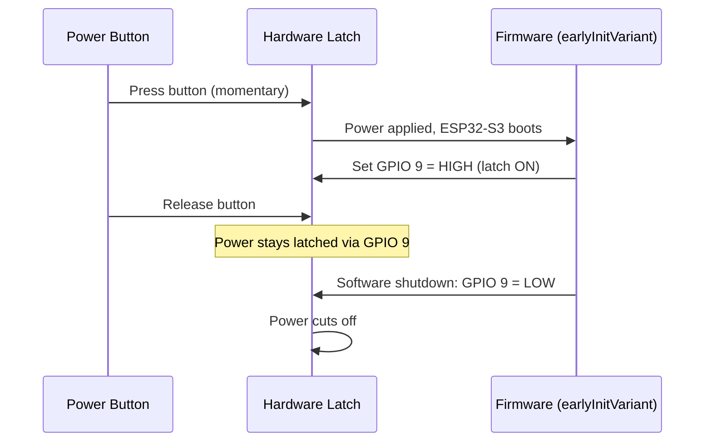

# TrekLink v2.0 Design Document

> **Hardware:** Custom PCB — ESP32-S3 + SX1268 433MHz + ICM-20948 IMU  
> **Version:** 1.0  
> **Date:** June 11, 2026  
> **Status:** DRAFT — Awaiting Review

---

## 1. Overview

TrekLink v2.0 is the custom PCB hardware variant. It replaces the v1.0 perfboard prototype with a purpose-built ESP32-S3 design manufactured by JLCPCB. This design document covers the architectural decisions, component mappings, and integration strategy specific to v2.0 hardware.

**Key Hardware Changes from v1.0:**

| Aspect | v1.0 (Perfboard) | v2.0 (Custom PCB) |
|--------|-------------------|--------------------|
| **MCU** | ESP32-WROOM-32 | ESP32-S3 |
| **LoRa** | Ra-02 SX1278 (SPI) | SX1268 (SPI + RXEN) |
| **IMU** | MPU6050 | ICM-20948 |
| **I2C** | SDA=21, SCL=22 | SDA=5, SCL=6 |
| **Power** | Slide switch | Soft power latch (GPIO 9) |
| **SOS GPIO** | GPIO 34 (input-only) | GPIO 4 (full I/O) |
| **Buttons** | GPIOs 25/32/34/35 | GPIOs 0/4/7/8 |

---

## 2. Architecture

### 2.1 Variant File Structure

```
variants/esp32s3/treklink_v2_0/
├── variant.h          # GPIO pin definitions (frozen per PCB netlist)
├── pins_arduino.h     # ESP32-S3 Arduino pin stub
└── platformio.ini     # Build environment [env:treklink-v2]
```

### 2.2 Build Environment

```ini
[env:treklink-v2]
extends = esp32s3_base
board = esp32-s3-devkitc-1   ; Or custom board JSON
build_flags =
  ${esp32s3_base.build_flags}
  -D TREKLINK_VARIANT
  -D TREKLINK_V2
  -D HAS_SCREEN=1
  -I variants/esp32s3/treklink_v2_0
lib_deps =
  ${esp32s3_base.lib_deps}
  ${radiolib_base.lib_deps}
  ${environmental_base.lib_deps}
```

The `TREKLINK_V2` define distinguishes v2.0 from other TrekLink variants at compile time.

---

## 3. Components and Interfaces

### 3.1 Power Latch Circuit



**Implementation**: The latch must be set in `earlyInitVariant()` (called very early in `setup()`) to prevent power loss during the boot sequence. A `variant.cpp` file will implement this.

```cpp
// variants/esp32s3/treklink_v2_0/variant.cpp
#ifdef TREKLINK_V2
void earlyInitVariant() {
    pinMode(POWER_LATCH_PIN, OUTPUT);
    digitalWrite(POWER_LATCH_PIN, HIGH);  // Keep power on
}
#endif
```

### 3.2 GPS Power Enable

GPIO 15 controls the GPS module's power rail. Must be driven HIGH before GPS UART init.

```cpp
#define GPS_EN_PIN 15  // In variant.h
```

Integration point: In `earlyInitVariant()` or via Meshtastic's `GPS_EN` define if supported.

### 3.3 SX1268 Radio Interface

v2.0 uses SX1268 with an external RF switch requiring RXEN control:

```cpp
// variant.h defines
#define USE_SX1268
#define LORA_SCK   21
#define LORA_MOSI  38
#define LORA_MISO  39
#define LORA_CS    14
#define LORA_RESET 40
#define LORA_DIO1  42   // SX1268 IRQ
#define LORA_DIO2  41   // SX1268 BUSY (maps to SX126X_BUSY)

#define SX126X_CS    LORA_CS
#define SX126X_DIO1  LORA_DIO1
#define SX126X_BUSY  LORA_DIO2
#define SX126X_RESET LORA_RESET
#define SX126X_RXEN  43  // External RF switch RX enable
```

### 3.4 Button GPIO Remapping Strategy

The button system uses `variant.h` defines consumed by both `TrekLinkButtonModule` and `TrekLinkButtonInput`:

```cpp
// variant.h
#define BUTTON_PIN     0   // SELECT/MENU (Meshtastic convention)
#define BUTTON_PIN_SOS 4   // Dedicated SOS button
#define BUTTON_PIN_UP  7   // UP navigation
#define BUTTON_PIN_DOWN 8  // DOWN navigation
```

**Key difference from v1.0**: All v2.0 GPIOs support internal pull-ups, so `INPUT_PULLUP` is used instead of relying on external resistors. The button polarity remains Active-Low (press = LOW).

### 3.5 ICM-20948 Fall Sensor Adapter

The ICM-20948 replaces the MPU6050 for fall detection. An `ICM20948FallSensor` adapter implements `FallSensorInterface` (defined in multi-variant spec):

```cpp
class ICM20948FallSensor : public FallSensorInterface {
    ICM_20948_I2C icm;
public:
    bool init() override;
    bool readAccel(float &x, float &y, float &z) override;  // Returns g-force
    bool readGyro(float &x, float &y, float &z) override;   // Returns rad/s
};
```

Uses the `SparkFun 9DoF IMU Breakout - ICM 20948` library already in `environmental_base.lib_deps`.

---

## 4. Data Models

No new data models. v2.0 uses the same Meshtastic protobuf structures, TrekLink message types, and SOS packet format as v1.0.

---

## 5. Error Handling

| Error Condition | Handling |
|---|---|
| Power latch GPIO 9 not set in time | Device powers off when button released — user must re-press |
| GPS EN (GPIO 15) stuck LOW | GPS module has no power — log warning, position unavailable |
| SX1268 init failure | Log error, continue booting — device runs without radio (degraded) |
| ICM-20948 not detected on I2C | Log warning, disable fall detection — SOS manual trigger still works |
| Button GPIO misconfigured | Static assert at compile time ensures GPIO defines exist |

---

## 6. Testing Strategy

### Unit Tests
- **Power latch timing**: Verify GPIO 9 goes HIGH within 100ms of `setup()` entry
- **Button polarity**: Verify INPUT_PULLUP mode reads HIGH when idle, LOW when pressed for all 4 buttons
- **ADC calibration**: Battery voltage on GPIO 1 reads within 5% of multimeter reference

### Integration Tests
- **Full boot sequence**: Device stays powered after power button release
- **Radio init**: SX1268 initializes on SPI bus, transmits test packet to v1.0 device
- **GPS fix**: GPS acquires fix within 60s outdoors after GPS_EN asserted
- **Fall detection**: ICM-20948 adapter provides data compatible with existing fall detection thresholds
- **Cross-variant**: v2.0 firmware compiles independently from v1.0 (`pio run -e treklink` and `pio run -e treklink-v2` both succeed)
