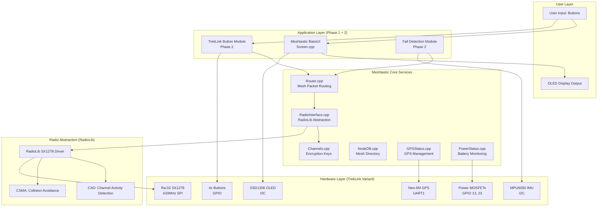
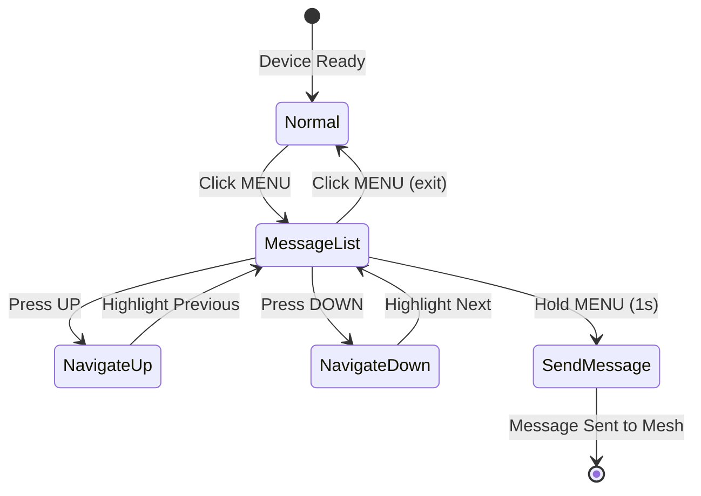

# TrekLink Design Document (Meshtastic Fork)

> **Project Code:** EXE101-G1-TREKLINK  
> **Version:** 2.0 (Meshtastic Architecture)  
> **Date:** February 4, 2026  
> **Status:** ENGINEERING APPROVED

---

## 1. Overview

TrekLink v2.0 is a **Meshtastic firmware v2.6.x fork** optimized for off-grid emergency communications. This design document details the technical architecture, hardware integration, and software components for migrating from proprietary E32 UART implementation to Ra-02 SPI with Meshtastic base firmware.

**Design Goals:**
- ✅ **Rapid Development:** Leverage Meshtastic's mature codebase (~16 hour Phase 1)
- ✅ **Universal Compatibility:** Interoperate with 100,000+ Meshtastic devices
- ✅ **Extensibility:** Add custom TrekLink features (fall detection, Silent Mode)
- ✅ **Risk Mitigation:** Device remains functional even if Phase 2 incomplete

**Key Architectural Changes from v1.0:**

| Aspect | v1.0 (Proprietary) | v2.0 (Meshtastic Fork) |
|--------|-------------------|------------------------|
| **Radio Module** | E32-433T20D (UART) | Ra-02 SX1278 (SPI) |
| **Firmware Base** | Custom ESP-IDF | Meshtastic v2.6.x |
| **Mesh Protocol** | Custom Managed Flooding | Meshtastic Routing |
| **Radio Driver** | Custom UART Commands | RadioLib SPI |
| **Encryption** | AES-128-GCM only | Meshtastic PKC + optional AES |
| **GPIO Allocation** | E32-specific (16,17,18,19,27) | SPI-specific (5,18,19,27,26,14) |
| **PRFH** | Implemented | **Deferred** (time sync complexity) |

---

## 2. System Architecture

### 2.1 High-Level Architecture



### 2.2 Meshtastic Firmware Stack

```
┌─────────────────────────────────────────────────────────────┐
│              Phase 2: TrekLink Custom Modules               │
│  - TrekLinkButtonModule (multi-button, Silent Mode)        │
│  - FallDetectionModule (MPU6050 monitoring, auto-SOS)      │
│  - TrekLinkProtocol (hybrid AES-128-GCM encryption)        │
├─────────────────────────────────────────────────────────────┤
│               Phase 1: Meshtastic Base Firmware             │
│  - BaseUI (Screen.cpp, graphics.cpp)                        │
│  - Router (packet routing, hop management)                  │
│  - RadioInterface (LoRa abstraction)                        │
│  - GPSStatus (TinyGPSPlus integration)                      │
│  - PowerStatus (battery ADC, power management)              │
│  - Channels (PKC encryption, key management)                │
│  - NodeDB (mesh node database, seen packets)                │
├─────────────────────────────────────────────────────────────┤
│                   RadioLib (SPI Driver)                     │
│  - SX1278 class (Ra-02 hardware interface)                  │
│  - CAD (Channel Activity Detection for low-power RX)        │
│  - CSMA (Carrier Sense Multiple Access)                     │
│  - Packet queue management                                  │
├─────────────────────────────────────────────────────────────┤
│            TrekLink Hardware Variant (variant.h)            │
│  - GPIO pin definitions (LORA_*, I2C_*, GPS_*, etc.)        │
│  - I2C/SPI bus configuration                                │
│  - Button/LED/Power gate mappings                           │
│  - ADC channels for battery sensing                         │
└─────────────────────────────────────────────────────────────┘
```

### 2.3 ESP32 Dual-Core Task Allocation

Meshtastic firmware uses FreeRTOS with dual-core task distribution:

| Core | Tasks | Priority | Purpose |
|------|-------|----------|---------|
| **Core 0** | RadioTask | 2 (Highest) | LoRa TX/RX, CAD listening, packet processing |
| | MeshRoutingTask | 1 | Packet routing, rebroadcast logic, seen buffer |
| **Core 1** | UITask | 0 (Lowest) | Screen rendering, button polling |
| | GPSTask | 0 | NMEA parsing, position updates |
| | [Phase 2] FallDetectionTask | 0 | MPU6050 monitoring (if implemented) |

**Core 0 Real-Time Constraints:**
- RadioTask must respond to DIO0 interrupts within 10ms
- CAD polling occurs every 100-500ms (configurable)
- No blocking operations allowed (delay() prohibited)

**Inter-Core Communication:**
- FreeRTOS Task Notifications (lightweight event signaling)
- Thread-safe queues for packet relay (Core 0 → Core 1 for UI updates)

---

## 3. Hardware Design

### 3.1 Hardware Block Diagram (Updated for Ra-02)

```mermaid
graph TB
    subgraph Power["Power Subsystem"]
        BATT[2x 21700 Li-Ion<br/>10000mAh Parallel<br/>3.7V Nominal]
        TP5100[TP5100 Charger<br/>USB-C Input<br/>2S Li-Ion]
        MINI360[Mini360 Buck<br/>3.3V + 5V Rails]
        BATT --> TP5100
        TP5100 -- CHRG Status --> GPIO35[GPIO 35]
        BATT --> MINI360
    end

    subgraph Core["Core Processing"]
        ESP32[ESP32-WROOM-32<br/>Dual-Core 240MHz<br/>520KB RAM]
        MINI360 -- 3.3V --> ESP32
    end

    subgraph Radio["Radio Subsystem (SPI)"]
        RA02[Ra-02 SX1278<br/>433MHz 100mW<br/>SPI Interface]
        ANT433[433MHz Antenna<br/>17.5cm Whip SMA]
        ESP32 -- "SCK (5)" --> RA02
        ESP32 -- "MISO (19)" --> RA02
        ESP32 -- "MOSI (27)" --> RA02
        ESP32 -- "CS (18)" --> RA02
        ESP32 -- "DIO0 (26)" --> RA02
        ESP32 -- "RESET (14)" --> RA02
        RA02 --> ANT433
    end

    subgraph Navigation["Navigation Subsystem"]
        GPS[Neo-6M GPS<br/>UART 9600 baud<br/>Internal Backup Batt]
        ANT_GPS[GPS Ceramic Antenna<br/>Internal]
        MOSFET_GPS[P-MOSFET IRF9530N<br/>GPS Power Gate]
        NPN_GPS[S8050-D NPN<br/>Gate Driver]
        ESP32 -- "GPIO 13" --> NPN_GPS
        NPN_GPS --> MOSFET_GPS
        MINI360 -- 3.3V --> MOSFET_GPS
        MOSFET_GPS --> GPS
        ESP32 -- "TX1 (16)" --> GPS
        ESP32 -- "RX1 (17)" --> GPS
        GPS --> ANT_GPS
    end

    subgraph Sensors["Sensor Subsystem"]
        MPU[MPU6050 IMU<br/>I2C 0x68<br/>Fall Detection]
        ESP32 -- "I2C SDA (21)" --> MPU
        ESP32 -- "I2C SCL (22)" --> MPU
        ESP32 -- "INT (34)" --> MPU
    end

    subgraph Display["Display Subsystem"]
        OLED[SSD1306 OLED<br/>0.96" 128x64<br/>I2C 0x3C]
        NPN_OLED[S8050-D NPN<br/>GND Switch]
        ESP32 -- "I2C SDA (21)" --> OLED
        ESP32 -- "I2C SCL (22)" --> OLED
        ESP32 -- "GPIO 23" --> NPN_OLED
        NPN_OLED -- GND Control --> OLED
    end

    subgraph UI["User Interface"]
        BTN_MENU[MENU Button<br/>GPIO 25]
        BTN_SOS[SOS Button<br/>GPIO 34]
        BTN_UP[UP Button<br/>GPIO 32]
        BTN_DOWN[DOWN Button<br/>GPIO 35]
        BUZZ[Passive Buzzer<br/>GPIO 33 PWM]
        VIB[Vibrator Motor<br/>GPIO 4 via NPN]
        LED[Status LED<br/>GPIO 2 Built-in]
        ESP32 --> BTN_MENU
        ESP32 --> BTN_SOS
        ESP32 --> BTN_UP
        ESP32 --> BTN_DOWN
        ESP32 --> BUZZ
        ESP32 --> VIB
        ESP32 --> LED
    end

    subgraph Battery_Sense["Battery Monitoring"]
        VOLTAGE_DIV[Voltage Divider<br/>10kΩ + 10kΩ]
        BATT --> VOLTAGE_DIV
        VOLTAGE_DIV -- ADC Input --> GPIO36[GPIO 36<br/>ADC1_CH0]
    end
```

### 3.2 GPIO Pinout Table (TrekLink Final Configuration)

#### LoRa Ra-02 (SPI Bus - VSPI)

| Signal | GPIO | Direction | Pull | Notes |
|--------|------|-----------|------|-------|
| **LORA_SCK** | 5 | Output | - | SPI Clock (Meshtastic DIY default) |
| **LORA_MISO** | 19 | Input | - | Master In Slave Out |
| **LORA_MOSI** | 27 | Output | - | Master Out Slave In |
| **LORA_CS** | 18 | Output | Pull-up | Chip Select (active LOW) |
| **LORA_DIO0** | 26 | Input | - | Interrupt: RX/TX done |
| **LORA_RESET** | 14 | Output | Pull-up | Module reset (active LOW) |

**SPI Configuration:**
- Bus: VSPI (hardware SPI)
- Clock: 4 MHz (SX1278 max: 10 MHz)
- Mode: SPI_MODE0 (CPOL=0, CPHA=0)

#### I2C Bus (Shared OLED + MPU6050)

| Signal | GPIO | Devices | Pull | Notes |
|--------|------|---------|------|-------|
| **I2C_SDA** | 21 | OLED (0x3C) + MPU (0x68) | 4.7kΩ external | Bidirectional data |
| **I2C_SCL** | 22 | OLED + MPU | 4.7kΩ external | Clock output |

**I2C Configuration:**
- Speed: 100 kHz (standard mode)
- Pull-ups: 4.7kΩ to 3.3V (external, required for I2C spec)

#### GPS Neo-6M (UART1)

| Signal | GPIO | Direction | ESP32 Function | Notes |
|--------|------|-----------|----------------|-------|
| **GPS_RX** | 16 | Output | TX1 | ESP32 transmits to GPS |
| **GPS_TX** | 17 | Input | RX1 | GPS transmits to ESP32 |

**UART Configuration:**
- Baud: 9600 (NMEA default)
- Format: 8N1 (8 data bits, no parity, 1 stop bit)
- Protocol: NMEA 0183 ($GPGGA, $GPRMC sentences)

#### User Interface Buttons

| Button | GPIO | Type | Pull | Function |
|--------|------|------|------|----------|
| **BTN_MENU** | 25 | Input | Internal pull-down | Menu navigation, Silent Mode (hold 1s) |
| **BTN_UP** | 32 | Input | Internal pull-down | Scroll up, increment |
| **BTN_DOWN** | 35 | Input Only | External pull-up | Scroll down, decrement |
| **BTN_SOS** | 34 | Input Only | External pull-up | Ping (1 click), SOS (3s hold) |

**Input-Only Constraint:**
- GPIO 34, 35 cannot output (no internal pull-ups available)
- External 10kΩ pull-up resistors required

#### Notifications & Indicators

| Output | GPIO | Type | Notes |
|--------|------|------|-------|
| **PIN_BUZZER** | 33 | PWM | Passive buzzer, 2.7kHz resonant freq |
| **PIN_VIBRATOR** | 4 | Digital | Coin vibrator via NPN transistor |
| **LED_PIN** | 2 | Digital | Built-in blue LED (also strapping pin, LOW at boot) |

#### Power Management

| Control | GPIO | Type | Function |
|---------|------|------|-------------|
| **BATTERY_PIN** | 36 | ADC Input Only | Voltage divider (100kΩ + 100kΩ, measures BAT/2) |
| ~~**PIN_GPS_PWR_EN**~~ | ~~13~~ | ~~Output~~ | ~~GPS P-MOSFET control (REMOVED)~~ |
| ~~**PIN_OLED_GND_EN**~~ | ~~23~~ | ~~Output~~ | ~~OLED GND switch (REMOVED)~~ |

**Note:** GPIO 13 and GPIO 23 are now available for future features. Hardware power gating removed in favor of Meshtastic firmware power management.

### 3.3 Power Management Strategy (Firmware-Based)

**Design Decision: Hardware Power Gating Removed**

Initial design included hardware power gating circuits:
- GPS P-MOSFET (GPIO 13) for power control
- OLED NPN switch (GPIO 23) for Silent Mode GND switching

**Why Removed:**
1. **GPS Cold Start Issue:** Cutting GPS power requires 5-10 minute reacquisition after power-on, defeating emergency use case
2. **User Confusion:** Separate Meshtastic sleep mode (firmware) vs Silent Mode (hardware) created ambiguous UX  
3. **Minimal Battery Savings:** GPS in Meshtastic power-save mode uses ~10mA; complete shutoff saves only 10mA (~2% total power)
4. **OLED Already Handled:** Meshtastic firmware stops I2C data when screen sleeps (0mA draw regardless of VCC)

**Final Approach: Meshtastic Firmware Power Management**

Power saving is now fully controlled via Meshtastic configuration:

```yaml
Power Settings (Meshtastic App):
  - Screen Timeout: 60 seconds (auto-sleep)
  - GPS Update Interval: 120 seconds (battery saver)
  - Light Sleep Enabled: Yes
  - Device Role: CLIENT (not ROUTER for max battery life)
```

**Wake Behavior:**
- Single-click MENU button → Screen on, GPS active
- Consistent UX with standard Meshtastic devices
- No cold start delays

**GPIO 13 and GPIO 23 Status:**
- Now available for future Phase 2 features if needed
- Currently commented out in `variant.h`

---
   - Measure resistance: OLED GND to ESP32 GND = OPEN (NPN off by default)
   - Measure voltage: OLED VCC = 3.3V (always powered)
   - Measure voltage: OLED VCC = 3.3V (always powered)

---

#### Perfboard Layout Tips

**Component Placement:**
1. Place P-MOSFET and NPN close together (minimizes gate wire length)
2. Place N-MOSFET near OLED connector
3. Route power rails along perfboard edges (Battery+, GND, 3.3V)
4. Use bus wire for GND and 3.3V rails (22 AWG solid core)

**Soldering Order:**
1. Solder all resistors first (R1, R2, R3)
2. Solder transistors/MOSFETs (Q1, Q2, Q3)
3. Solder power rail connections
4. Solder GPIO wires last (flexible 26 AWG stranded)

**Testing Without Peripherals:**
1. Power ESP32 only (no GPS, no OLED connected)
2. Measure voltage at P-MOSFET drain (GPS VCC point):
   - GPIO 13 = LOW → 0V (MOSFET off)
   - GPIO 13 = HIGH → 3.3V (MOSFET on, via regulator)
3. Measure resistance OLED GND to ESP32 GND:
   - GPIO 23 = LOW → OPEN (MOSFET off)
   - GPIO 23 = HIGH → \u003c 1Ω (MOSFET on)

**Common Build Mistakes:**
- ❌ P-MOSFET Source/Drain swapped → GPS gets 7.4V directly (damage!)
- ❌ Pull-up R2 connected to GND instead of Battery (+) → GPS always off
- ❌ Using high-Vgs MOSFET for OLED → Silent Mode doesn't work
- ❌ No pull-down R3 on N-MOSFET gate → OLED flickers randomly
- ❌ Forgetting 3.3V regulator between P-MOSFET and GPS → 7.4V burns GPS!

---

#### Firmware Control Example

```cpp
// In setup()
pinMode(PIN_GPS_PWR_EN, OUTPUT);    // GPIO 13
pinMode(PIN_OLED_GND_EN, OUTPUT);   // GPIO 23

digitalWrite(PIN_GPS_PWR_EN, HIGH);   // GPS ON
digitalWrite(PIN_OLED_GND_EN, HIGH);  // OLED ON

// To enable Silent Mode (in TrekLinkButtonModule)
void toggleSilentMode() {
    static bool silentMode = false;
    silentMode = !silentMode;
    
    digitalWrite(PIN_OLED_GND_EN, silentMode ? LOW : HIGH);
    
    // Vibrate confirmation
    digitalWrite(PIN_VIBRATOR, HIGH);
    delay(200);
    digitalWrite(PIN_VIBRATOR, LOW);
}

// To power-gate GPS (in GPS module)
void disableGPS() {
    digitalWrite(PIN_GPS_PWR_EN, LOW);  // Cut GPS power
    delay(10);  // Allow capacitors to discharge
}

void enableGPS() {
    digitalWrite(PIN_GPS_PWR_EN, HIGH);  // Restore GPS power
    delay(100);  // Wait for GPS boot (cold start)
}
```

---

## 4. Software Architecture (Meshtastic Integration)

### 4.1 Meshtastic Core Components

#### 4.1.1 Router (src/mesh/Router.cpp)

**Responsibility:** Packet routing, hop management, seen buffer deduplication.

**Key Functions:**
```cpp
class Router {
    // Receive packet from radio, process routing logic
    void handleFromRadio(MeshPacket *packet);
    
    // Send packet to radio with hop count initialization
    void sendPacket(MeshPacket *packet);
    
    // Check if packet already seen (prevent broadcast storm)
    bool wasSeenRecently(PacketId id);
    
    // Rebroadcast logic based on hop count and channel
    void rebroadcastPacket(MeshPacket *packet);
};
```

**TrekLink Modifications (Phase 2):**
- Inject custom TrekLink packet types (PortNum_PRIVATE_APP)
- Override rebroadcast logic for TrekLink Private mode filtering

#### 4.1.2 RadioInterface (src/mesh/RadioInterface.cpp)

**Responsibility:** Abstract radio hardware using RadioLib.

**Key Functions:**
```cpp
class RadioInterface {
    // Initialize SX1278 with region-specific config
    bool init();
    
    // Transmit packet with CSMA collision avoidance
    bool sendPacket(MeshPacket *packet);
    
    // Check for incoming packets using CAD
    void loop(); // Called continuously from RadioTask
    
    // Handle DIO0 interrupt (RX/TX done)
    void handleInterrupt();
};
```

**TrekLink Configuration:**
```cpp
// In variants/treklink_esp32/variant.h
#define LORA_REGION Meshtastic_Region_EU_433
#define LORA_SCK 5
#define LORA_MISO 19
#define LORA_MOSI 27
#define LORA_CS 18
#define LORA_DIO0 26
#define LORA_RESET 14
```

#### 4.1.3 Channels (src/mesh/Channels.cpp)

**Responsibility:** Encryption key management, channel switching.

**Key Functions:**
```cpp
class Channels {
    // Derive AES256 key from PSK
    void initDefaultChannel(const uint8_t *psk, size_t pskLen);
    
    // Encrypt payload with Meshtastic PKC
    bool encryptPacket(MeshPacket *packet);
    
    // Decrypt and authenticate received packet
    bool decryptPacket(MeshPacket *packet);
};
```

**TrekLink Enhancement (Phase 2):**
- Add secondary encryption layer (AES-128-GCM) using Channel ID as seed
- Mode switching: Meshtastic PKC only (public) vs. PKC + AES-GCM (private)

#### 4.1.4 GPSStatus (src/gps/GPSStatus.cpp)

**Responsibility:** GPS management, position tracking.

**Key Functions:**
```cpp
class GPSStatus {
    // Parse NMEA sentences from Neo-6M
    void loop();
    
    // Get last valid position
    Position getPosition();
    
    // Check if GPS has fix
    bool hasValidFix();
};
```

**TrekLink Power Gating (Phase 2):**
```cpp
void enableGPS() {
    digitalWrite(PIN_GPS_PWR_EN, HIGH); // Turn on P-MOSFET
    delay(100); // Wait for GPS boot
}

void disableGPS() {
    digitalWrite(PIN_GPS_PWR_EN, LOW); // Cut GPS power
}
```

---

### 4.2 TrekLink Custom Modules (Phase 2 Optional)

#### 4.2.1 TrekLinkButtonModule

**File:** `src/modules/TrekLinkButtonModule.cpp`

**Responsibility:** Multi-button support, Silent Mode, custom button actions.

```cpp
class TrekLinkButtonModule : public SinglePortModule {
private:
    enum ButtonState {
        IDLE,
        PRESS_DETECTED,
        HOLD_DETECTED,
        DOUBLE_CLICK_WAITING
    };
    
    ButtonState menuState, sosState, upState, downState;
    unsigned long menuPressTime, sosPressTime;
    
public:
    void setup() override {
        pinMode(BTN_MENU, INPUT_PULLDOWN);
        pinMode(BTN_SOS, INPUT);
        pinMode(BTN_UP, INPUT_PULLDOWN);
        pinMode(BTN_DOWN, INPUT);
        
        // Attach interrupt for SOS (critical button)
        attachInterrupt(digitalPinToInterrupt(BTN_SOS), onSOSPressed, FALLING);
    }
    
    int32_t runOnce() override {
        // Poll buttons every 50ms
        handleMenuButton();
        handleSOSButton();
        handleUpDownButtons();
        return 50; // Run again in 50ms
    }
    
private:
    void handleMenuButton() {
        if (digitalRead(BTN_MENU) == HIGH) {
            if (menuState == IDLE) {
                menuPressTime = millis();
                menuState = PRESS_DETECTED;
            } else if (menuState == PRESS_DETECTED && (millis() - menuPressTime > 1000)) {
                toggleSilentMode();
                menuState = HOLD_DETECTED;
            }
        } else {
            if (menuState == PRESS_DETECTED && (millis() - menuPressTime < 1000)) {
                // Short press: Navigate menu
                navigateMenu();
            }
            menuState = IDLE;
        }
    }
    
    void handleSOSButton() {
        if (digitalRead(BTN_SOS) == HIGH) {
            if (sosState == IDLE) {
                sosPressTime = millis();
                sosState = PRESS_DETECTED;
            } else if (sosState == PRESS_DETECTED && (millis() - sosPressTime > 3000)) {
                triggerSOS();
                sosState = HOLD_DETECTED;
            }
        } else {
            if (sosState == PRESS_DETECTED && (millis() - sosPressTime < 1000)) {
                // Single click: Ping location
                broadcastPosition();
            }
            sosState = IDLE;
        }
    }
    
    void toggleSilentMode() {
        static bool silentMode = false;
        silentMode = !silentMode;
        
        // Hardware power gate OLED
        digitalWrite(PIN_OLED_GND_EN, silentMode ? LOW : HIGH);
        
        // Vibrate confirmation
        digitalWrite(PIN_VIBRATOR, HIGH);
        delay(200);
        digitalWrite(PIN_VIBRATOR, LOW);
    }
    
    void triggerSOS() {
        // Create high-priority SOS packet
        MeshPacket packet;
        packet.channel = 0; // Primary channel (broadcast)
        packet.priority = MeshPacket_Priority_CRITICAL;
        packet.want_ack = false; // No ACK needed for broadcast
        
        // Populate position data
        Position pos = service.gps->getPosition();
        packet.decoded.position = pos;
        
        // Send via Meshtastic router
        service.sendPacket(&packet);
        
        // Activate local SOS indicators
        activateSOSAlarms();
    }
    
    void activateSOSAlarms() {
        // Buzzer: Continuous alarm
        ledcAttachPin(PIN_BUZZER, 0);
        ledcSetup(0, 2700, 8); // 2.7kHz, 8-bit resolution
        ledcWrite(0, 128); // 50% duty cycle
        
        // LED: Strobe pattern
        // Vibrator: Pulse pattern
        // (Handled by separate task)
    }
};
```

#### 4.2.2 FallDetectionModule

**File:** `src/modules/FallDetectionModule.cpp`

**Responsibility:** MPU6050 monitoring, fall signature detection, auto-SOS trigger.

```cpp
class FallDetectionModule : public ProtobufModule<MeshPacket> {
private:
    enum FallState {
        MONITORING,
        FREEFALL_DETECTED,
        IMPACT_DETECTED,
        INACTIVITY_DETECTED,
        PRE_ALARM,
        SOS_TRIGGERED
    };
    
    FallState state;
    Adafruit_MPU6050 mpu;
    unsigned long freefallStartTime, impactTime, inactivityStartTime, prealarmStartTime;
    
    const float FREEFALL_THRESHOLD = 0.3; // g (< 0.3g indicates freefall)
    const float IMPACT_THRESHOLD = 3.0;   // g (> 3g indicates impact)
    const int FREEFALL_MIN_DURATION = 500; // ms
    const int INACTIVITY_DURATION = 10000; // 10 seconds
    const int PREALARM_TIMEOUT = 30000;    // 30 seconds
    
public:
    void setup() override {
        Wire.begin(I2C_SDA, I2C_SCL);
        
        if (!mpu.begin(0x68)) {
            LOG_ERROR("MPU6050 not found!");
            return;
        }
        
        // Configure MPU6050
        mpu.setAccelerometerRange(MPU6050_RANGE_8_G);
        mpu.setGyroRange(MPU6050_RANGE_500_DEG);
        mpu.setFilterBandwidth(MPU6050_BAND_21_HZ);
        
        // Enable motion interrupt on INT pin (GPIO 34)
        pinMode(34, INPUT);
        
        state = MONITORING;
    }
    
    int32_t runOnce() override {
        sensors_event_t accel, gyro, temp;
        mpu.getEvent(&accel, &gyro, &temp);
        
        float totalAccel = sqrt(sq(accel.acceleration.x) + 
                                sq(accel.acceleration.y) + 
                                sq(accel.acceleration.z));
        
        switch (state) {
            case MONITORING:
                // Detect freefall (total acceleration < 0.3g)
                if (totalAccel < FREEFALL_THRESHOLD) {
                    freefallStartTime = millis();
                    state = FREEFALL_DETECTED;
                }
                break;
                
            case FREEFALL_DETECTED:
                if (totalAccel > FREEFALL_THRESHOLD) {
                    // Check if freefall lasted long enough
                    if (millis() - freefallStartTime > FREEFALL_MIN_DURATION) {
                        // Freefall ended, now detect impact
                        state = IMPACT_DETECTED;
                        impactTime = millis();
                    } else {
                        // False alarm, return to monitoring
                        state = MONITORING;
                    }
                }
                break;
                
            case IMPACT_DETECTED:
                // Look for high-G impact within 2 seconds of freefall
                if (totalAccel > IMPACT_THRESHOLD) {
                    inactivityStartTime = millis();
                    state = INACTIVITY_DETECTED;
                } else if (millis() - impactTime > 2000) {
                    // No impact detected, false alarm
                    state = MONITORING;
                }
                break;
                
            case INACTIVITY_DETECTED:
                // Check for movement (total accel deviates from 1g)
                if (abs(totalAccel - 1.0) > 0.2) {
                    // User is moving, cancel fall detection
                    state = MONITORING;
                } else if (millis() - inactivityStartTime > INACTIVITY_DURATION) {
                    // Inactivity threshold reached, enter pre-alarm
                    state = PRE_ALARM;
                    prealarmStartTime = millis();
                    activatePreAlarm();
                }
                break;
                
            case PRE_ALARM:
                // Wait for user to cancel (SOS double-click handled by ButtonModule)
                if (millis() - prealarmStartTime > PREALARM_TIMEOUT) {
                    // Timeout reached, trigger auto-SOS
                    state = SOS_TRIGGERED;
                    triggerAutoSOS();
                }
                // Check if user cancelled (external flag set by ButtonModule)
                if (fallCancelledByUser) {
                    state = MONITORING;
                    deactivatePreAlarm();
                }
                break;
                
            case SOS_TRIGGERED:
                // SOS active indefinitely until user cancels
                break;
        }
        
        return 100; // Check every 100ms
    }
    
private:
    void activatePreAlarm() {
        // Display countdown on OLED
        screen->setStatusMessage("FALL DETECTED! 30s to cancel");
        
        // Rapid vibration pattern
        // Beeping alarm
        // (Implementation similar to TrekLinkButtonModule)
    }
    
    void triggerAutoSOS() {
        // Same as manual SOS trigger in ButtonModule
        MeshPacket packet;
        packet.channel = 0;
        packet.priority = MeshPacket_Priority_CRITICAL;
        packet.decoded.position = service.gps->getPosition();
        service.sendPacket(&packet);
        
        // Activate full SOS indicators
    }
};
```

---

## 5. Data Models & Interfaces

### 5.1 Meshtastic Packet Structure (Protobuf)

**MeshPacket (Standard Meshtastic):**
```protobuf
message MeshPacket {
    uint32 id = 1;           // Unique packet ID (prevents duplicates)
    fixed32 from = 2;        // Sending node ID
    fixed32 to = 3;          // Target node ID (0xFFFFFFFF = broadcast)
    uint32 channel = 4;      // Channel index (0 = primary)
    Data decoded = 5;        // Decrypted payload
    bytes encrypted = 6;     // Encrypted payload (if not decoded)
    uint32 rx_time = 7;      // Receive timestamp
    int32 rx_snr = 8;        // Signal-to-Noise Ratio
    int32 rx_rssi = 9;       // Received Signal Strength
    uint32 hop_limit = 10;   // Remaining hops
    bool want_ack = 11;      // Request acknowledgment
    Priority priority = 12;  // UNSET, MIN, BACKGROUND, DEFAULT, RELIABLE, CRITICAL (SOS)
}

message Data {
    PortNum portnum = 1;     // Type: TEXT_MESSAGE_APP, POSITION_APP, NODEINFO_APP, PRIVATE_APP
    bytes payload = 2;       // Actual message data
}
```

**TrekLink Private Packet (Phase 2):**
```cpp
// Encapsulated within PortNum_PRIVATE_APP
struct TrekLinkPrivatePayload {
    uint8_t version = 0x01;
    uint8_t channelId;              // Custom Channel ID for AES-GCM key derivation
    uint8_t encryptedData[64];      // AES-128-GCM encrypted
    uint8_t authTag[16];            // GCM authentication tag
    uint8_t nonce[12];              // Nonce for GCM (concat timestamp + random)
};
```

### 5.2 GPS Data Model

**TinyGPSPlus Integration (Meshtastic Default):**
```cpp
struct Position {
    double latitude;   // Decimal degrees
    double longitude;  // Decimal degrees
    int32_t altitude;  // Meters above MSL
    uint32_t time;     // Unix timestamp
    uint8_t sats;      // Satellites in view
    uint32_t precision_bits; // PDOP precision indicator
};
```

**Power Gating Strategy:**
```cpp
// GPS polling with power gating
void GPSTask() {
    while (true) {
        enableGPS();           // Turn on via GPIO 13
        delay(5000);           // Wait for GPS acquisition (hot start: <2s)
        Position pos = gps->getPosition();
        disableGPS();          // Cut power
        
        if (pos.isValid()) {
            // Share position with mesh
            broadcastPosition(pos);
        }
        
        vTaskDelay(pdMS_TO_TICKS(GPS_UPDATE_INTERVAL)); // Default: 60s
    }
}
```

---

## 6. Error Handling & Resilience

### 6.1 Radio Failures

**CAD Timeout:**
```cpp
// If no packet heard for 5 minutes, assume radio failure
if (millis() - lastPacketTime > 300000) {
    LOG_WARN("Radio silence detected, reinitializing SX1278...");
    radio.reset();
    radio.begin(433.0, 125.0, 9, 7, 20);
}
```

**TX Failure Recovery:**
```cpp
int retryCount = 0;
while (radio.transmit(packet) != RADIOLIB_ERR_NONE && retryCount < 3) {
    LOG_ERROR("TX failed, retrying... (%d/3)", retryCount);
    delay(100);
    retryCount++;
}
```

### 6.2 GPS Failures

**Fallback Strategy (Phase 2):**
1. **No GPS fix:** Display last known position + "GPS searching..."
2. **Extended no-fix (>10 min):** Attempt RSSI triangulation using mesh nodes
3. **No mesh nodes:** Use dead reckoning (IMU-based position estimation)

### 6.3 Power Failures

**Low Battery Protocol:**
```cpp
if (batteryVoltage < 3.2) { // Per-cell voltage (6.4V total for 2S)
    // Disable non-critical peripherals
    disableGPS();
    digitalWrite(PIN_OLED_GND_EN, LOW); // Turn off OLED
    
    // Enter deep sleep, wake every 60s for emergency RX
    esp_sleep_enable_timer_wakeup(60 * 1000000); // 60 seconds in μs
    esp_deep_sleep_start();
}
```

---

## 7. Testing Strategy

### 7.1 Unit Tests (Isolated Components)

**Test 1: Ra-02 SPI Communication**
```cpp
void test_ra02_init() {
    RadioLib SX1278 radio = new Module(18, 26, 14, 19);
    int state = radio.begin(433.0, 125.0, 9, 7, 20);
    assert(state == RADIOLIB_ERR_NONE);
    printf("✓ Ra-02 initialized successfully\n");
}
```

**Test 2: GPS NMEA Parsing**
```cpp
void test_gps_parsing() {
    const char *nmea = "$GPGGA,123519,4807.038,N,01131.000,E,1,08,0.9,545.4,M,46.9,M,,*47";
    TinyGPSPlus gps;
    for (const char *c = nmea; *c; c++) {
        gps.encode(*c);
    }
    assert(gps.location.isValid());
    assert(abs(gps.location.lat() - 48.1173) < 0.01);
    printf("✓ GPS parsing correct\n");
}
```

**Test 3: MPU6050 I2C Detection**
```cpp
void test_mpu6050() {
    Wire.begin(21, 22);
    Wire.beginTransmission(0x68);
    int error = Wire.endTransmission();
    assert(error == 0);
    printf("✓ MPU6050 detected on I2C\n");
}
```

### 7.2 Integration Tests (Multi-Device)

**Test 1: Mesh Packet RX/TX (2 devices)**
- **Setup:** TrekLink + Standard Meshtastic T-Beam (both on EU_433)
- **Procedure:** Send text message from T-Beam → TrekLink
- **Expected:** TrekLink receives packet within 5s, displays on OLED

**Test 2: Position Broadcast (1 device + app)**
- **Setup:** TrekLink with GPS fix + Meshtastic Android app
- **Procedure:** Click SOS button on TrekLink
- **Expected:** Android app shows TrekLink position on map

### 7.3 Phase 2 Tests (Custom Features)

**Test 1: Fall Detection**
- **Setup:** TrekLink with Phase 2 firmware
- **Procedure:** Drop device from 1.5m onto soft surface
- **Expected:** Pre-alarm triggers (30s countdown), auto-SOS if not cancelled

**Test 2: Silent Mode**
- **Setup:** TrekLink with Phase 2 firmware
- **Procedure:** Hold MENU button for 1 second
- **Expected:** OLED turns off (GPIO 23 → LOW), vibrator confirms

**Test 3: Hybrid Encryption**
- **Setup:** 2x TrekLink (Phase 2) + 1x Standard Meshtastic
- **Procedure:** Send TrekLink Private message
- **Expected:** Only TrekLink devices decrypt, standard device cannot

---

## 8. Design Decisions & Trade-offs

### 8.1 Why Meshtastic Fork?

**Advantages:**
✅ Mature RadioLib SPI driver (proven SX1278 support)  
✅ 100,000+ compatible devices (instant ecosystem)  
✅ Active development (OTA updates, bug fixes)  
✅ Proven power management (light sleep, CAD optimization)  
✅ Strong encryption (PKC with per-channel keys)  

**Disadvantages:**
❌ Loss of PRFH anti-jamming (deferred)  
❌ Custom UI requires forking BaseUI  
❌ Learning curve for Meshtastic codebase  
❌ Dependency on upstream changes  

**Verdict:** Advantages outweigh disadvantages for MVP timeline.

### 8.2 Why Remove PRFH?

**Technical Challenge:**
- PRFH requires **nanosecond-accurate time synchronization** across all mesh nodes
- GPS time sync works, but nodes boot at different times (desync up to hours)
- Implementing "join protocol" for new nodes to catch hopping sequence adds 10-15 hours

**Alternative:**
- Use Meshtastic's static frequency per region (EU_433 = 433.175 MHz default)
- Rely on AES-256 PKC encryption for security (industry standard)
- Phase 2 may revisit PRFH if time allows

### 8.3 Why SPI Instead of UART?

**Ra-02 SX1278 Advantages:**
✅ Direct register access (faster configuration changes)  
✅ RadioLib compatibility (mature, well-tested library)  
✅ Lower latency (SPI @ 4 MHz vs UART @ 115200 baud)  
✅ No AT command parsing overhead  

**E32 UART Disadvantages:**
❌ Proprietary AT commands (vendor lock-in)  
❌ Channel switching delay (80ms M0/M1 settling)  
❌ Internal MCU black box (cannot debug RF issues)  

---

## 9. Future Enhancements

### Post-MVP Features (Beyond Phase 2)

🔮 **PRFH Anti-Jamming:** Implement if GPS time sync + join protocol solved  
🔮 **Custom Android App:** TrekLink-specific UI for preset messages, dot matrix map  
🔮 **Wi-Fi AP Configuration:** Web interface for device settings (no phone app needed)  
🔮 **Dead Reckoning:** IMU-based position estimation when GPS unavailable  
🔮 **RSSI Triangulation:** Mesh-based positioning using neighbor RSSI measurements  
🔮 **Offline Map Tiles:** Store OpenStreetMap tiles in SPIFFS for true offline navigation  
🔮 **Voice Codec:** Low-bitrate voice transmission (e.g., Codec2 @ 1.2 kbps)  

---

## 10. References & Resources

**Meshtastic Documentation:**
- Official Docs: https://meshtastic.org/docs/introduction
- Firmware GitHub: https://github.com/meshtastic/firmware
- Hardware Variants: https://meshtastic.org/docs/hardware

**RadioLib (SX1278 Driver):**
- GitHub: https://github.com/jgromes/RadioLib
- SX1278 Datasheet: https://www.semtech.com/products/wireless-rf/lora-core/sx1278

**TrekLink Project Resources:**
- Implementation Plan: `implementation_plan.md`
- GPIO Pinout: `gpio_pinout_comparison.md`
- Requirements: `.kiro/specs/treklink/requirements.md`
- System Spec: `specifications.md`

---

## 11. TrekLink Power Wiring (1S2P 21700 Battery Configuration)

### 11.1 Battery Pack Configuration

**Configuration:** 1S2P (1 Series, 2 Parallel)  
**Chemistry:** Li-Ion 21700 cells (Samsung 50E or equivalent)  
**Nominal Voltage:** 3.7V  
**Total Capacity:** 10,000mAh (2x 5000mAh in parallel)  
**Voltage Range:** 3.0V (cutoff) to 4.2V (fully charged)

**Wiring:**
```
[Cell 1 +] ──┬── Main BAT+ (3.7V nominal, 4.2V max)
             │
[Cell 2 +] ──┘

[Cell 1 -] ──┬── Main GND
             │
[Cell 2 -] ──┘
```

**Safety Notes:**
- ⚠️ Match cell capacities within 50mAh (use cells from same batch)
- ⚠️ Ensure both cells have same voltage before paralleling (within 0.1V)
- ⚠️ Use spring-loaded holders or spot-welded nickel strips (NO solder directly to cells)

---

### 11.2 Charger Module (TP5100)

**Component:** TP5100 2A dual-cell Li-Ion charger module  
**Input:** 5V USB-C (or barrel jack 5-9V DC)  
**Charge Current:** 1A (adjustable via onboard resistor)  
**Protection:** Overcharge, over-discharge, short circuit

**Wiring:**
```
[External DC 5V+] ── TP5100 VIN+
[External DC GND] ── TP5100 VIN-

[Main BAT+] ──────── TP5100 BAT+
[Main GND] ──────── TP5100 BAT-
```

**Status Indicators:**
- **Red LED:** Charging active
- **Green LED:** Charge complete
- **CHRG Pin:** Can connect to ESP32 GPIO 35 for charge status monitoring (optional)

---

### 11.3 Voltage Regulator (Mini360 HM Buck Converter)

**Component:** Mini360 HM DC-DC step-down converter  
**Input Range:** 3.0V - 7.4V (supports 1S or 2S Li-Ion)  
**Output:** 3.3V (adjustable via potentiometer)  
**Max Current:** 1.8A (sufficient for ESP32 + Ra-02 + peripherals)  
**Efficiency:** ~96% at 3.7V input

**Wiring:**
```
[Main BAT+] ──────── Mini360 IN+
[Main GND] ──────── Mini360 IN-

ADJUST MINI360 POTENTIOMETER TO 3.3V OUTPUT (use multimeter)

[Mini360 OUT+] ──┬── ESP32 3V3 pin
                 ├── Ra-02 VCC (3.3V)
                 ├── GPS Neo-6M VCC (via P-MOSFET power gate, GPIO 13)
                 ├── OLED VCC
                 └── MPU6050 VCC

[Mini360 OUT-] ──── ESP32 GND (and all component GND)
```

**Adjustment Procedure:**
1. Connect Mini360 input to 3.7V source (or battery)
2. Measure output voltage with multimeter
3. Turn potentiometer clockwise to increase, counter-clockwise to decrease
4. Set to **3.3V ± 0.05V**
5. Verify under load (connect ESP32, check voltage remains stable)

**Critical Notes:**
- ⚠️ **NEVER apply 7.4V (2S battery) to ESP32 directly!** Always use Mini360 regulator
- ⚠️ Solder 100µF - 1000µF capacitor across Mini360 output for stability (see BOM)

---

### 11.4 Battery Fuel Gauge (Voltage Divider for ADC Monitoring)

**Purpose:** Measure battery voltage via ESP32 ADC to estimate remaining capacity  
**Method:** Resistive voltage divider (2:1 ratio) to bring 4.2V max battery voltage within ESP32 ADC range (0-3.3V)

**Components Required:**
- **Resistor A (R_TOP):** 100kΩ (1/4W, 1% tolerance)
- **Resistor B (R_BOTTOM):** 100kΩ (1/4W, 1% tolerance)
- **GPIO Pin:** GPIO 36 (ADC1_CH0, input-only pin on ESP32)

**Wiring Diagram:**
```
[Main BAT+] ──────┬─── (direct to TP5100 and Mini360)
                  │
                  ├─── 100kΩ Resistor A (R_TOP)
                  │
                  ├─── ESP32 GPIO 36 (ADC1_CH0)  ← Measure here
                  │
                  ├─── 100kΩ Resistor B (R_BOTTOM)
                  │
[Main GND] ────────┴
```

**Voltage Divider Calculation:**
```
V_ADC = V_BAT × (R_BOTTOM / (R_TOP + R_BOTTOM))
V_ADC = V_BAT × (100kΩ / 200kΩ) = V_BAT × 0.5
```

**Example Readings:**
| Battery Voltage | ADC Voltage (GPIO 36) | Battery % | State |
|----------------|-----------------------|-----------|-------|
| 4.2V (full) | 2.1V | 100% | Fully charged |
| 3.7V (nominal) | 1.85V | ~50% | Normal operation |
| 3.3V (low) | 1.65V | ~20% | Low battery warning |
| 3.0V (cutoff) | 1.5V | 0% | Critical - shutdown |

**Firmware Configuration (variant.h):**
```cpp
#define BATTERY_PIN 36       // ADC1_CH0 input-only
#define ADC_CHANNEL ADC1_GPIO36_CHANNEL
#define ADC_MULTIPLIER 2.0   // Voltage divider ratio (100k/100k = 2:1)
```

**Meshtastic ADC Reading (automatic):**
Meshtastic firmware reads battery voltage via `PowerStatus.cpp` and displays % on OLED + reports via telemetry packets.

**Important Notes:**
- ✅ **GPIO 36 is input-only** (no internal pull-up/down), ideal for ADC
- ✅ Use **1% tolerance resistors** for accurate voltage measurement
- ⚠️ **Do NOT use GPIO 32** (originally proposed) - it conflicts with button assignments and is not ideal for ADC due to touch sensor interference
- ⚠️ Solder 0.1µF ceramic capacitor from GPIO 36 to GND for noise filtering (optional but recommended)

---

### 11.5 Complete Power Distribution Schematic

```
                          ┌─────────────────────────────────────┐
                          │   BATTERY PACK (1S2P 21700)        │
                          │   Cell 1 + Cell 2 (Parallel)       │
                          │   3.7V Nominal, 10,000mAh Total    │
                          └──────────┬──────────────────────────┘
                                     │ BAT+
                 ┌───────────────────┼───────────────────┐
                 │                   │                   │
                 │                   │                   │
          ┌──────▼──────┐     ┌──────▼──────┐    ┌──────▼──────┐
          │  TP5100     │     │  Mini360    │    │  Voltage    │
          │  Charger    │     │  Buck 3.3V  │    │  Divider    │
          │  (USB-C)    │     │  Regulator  │    │  (ADC)      │
          └─────────────┘     └──────┬──────┘    │  100k+100k  │
                                     │ 3.3V      │  → GPIO 36  │
                                     │           └─────────────┘
                 ┌───────────────────┼───────────────────┐
                 │                   │                   │
          ┌──────▼──────┐     ┌──────▼──────┐    ┌──────▼──────┐
          │  ESP32      │     │  Ra-02 LoRa │    │  GPS (via   │
          │  WROOM-32   │     │  SX1278     │    │  P-MOSFET)  │
          │  (MCU)      │     │  433MHz SPI │    │  GPIO 13    │
          └─────────────┘     └─────────────┘    └─────────────┘
                 │                   │                   │
          ┌──────▼──────┐     ┌──────▼──────┐           │
          │  OLED (via  │     │  MPU6050    │           │
          │  NPN GND)   │     │  IMU I2C    │           │
          │  GPIO 23    │     │  0x68       │           │
          └─────────────┘     └─────────────┘           │
                 │                   │                   │
                 └───────────────────┴───────────────────┘
                                     │ GND
                                     ▼
                                  Main GND
```

---

### 11.6 Power-On Sequence (Build Order)

**Step 1: Battery Pack Assembly**
1. Insert 2x 21700 cells into parallel holder
2. Verify voltage: Both cells within 0.1V of each other
3. Measure total voltage: Should be 3.7V ± 0.2V

**Step 2: Charger Connection**
1. Connect TP5100 BAT+ to battery pack +
2. Connect TP5100 BAT- to battery pack -
3. Plug USB-C cable, verify red LED lights up (charging)
4. Wait until green LED (charge complete)

**Step 3: Mini360 Adjustment**
1. Connect Mini360 IN+ to BAT+, IN- to GND
2. **WITHOUT connecting ESP32**, measure Mini360 OUT voltage
3. Adjust potentiometer to **3.30V ± 0.05V**
4. Verify stability under no-load condition

**Step 4: Voltage Divider Verification**
1. Solder 100kΩ + 100kΩ resistors in series
2. Connect top resistor to BAT+
3. Connect bottom resistor to GND
4. Measure voltage at junction (should be **~1.85V** for 3.7V battery)
5. Connect junction to ESP32 GPIO 36

**Step 5: Power ESP32 + Peripherals**
1. Connect Mini360 OUT+ to ESP32 3V3 pin
2. Connect Mini360 OUT- to ESP32 GND
3. Power on → ESP32 should boot (blue LED blinks)
4. Verify serial output: `Meshtastic 2.7.19`

**Step 6: Verify Battery Monitoring**
1. Flash TrekLink firmware
2. Check serial log for battery voltage reading
3. Expected log: `Battery: 3.7V (50%)`
4. Verify OLED displays battery icon with correct %

---

### 11.7 Troubleshooting Power Issues

| **Symptom** | **Cause** | **Fix** |
|-------------|-----------|---------|
| ESP32 won't boot | Mini360 output ≠ 3.3V | Re-adjust potentiometer with multimeter |
| Battery % shows 0% | Voltage divider wiring error | Verify GPIO 36 connected to resistor junction |
| Battery % shows \u003e100% | Wrong `ADC_MULTIPLIER` in firmware | Should be 2.0 for 100k+100k divider |
| TP5100 red LED always on | Battery voltage \u003c 3.0V (over-discharged) | Charge via USB-C for 30+ minutes |
| Mini360 gets hot | Output short circuit | Disconnect all loads, check for solder bridges |
| GPS not powering on | P-MOSFET circuit issue (GPIO 13) | See Section 3.3 power gating wiring |

---

## 6. Canned Message System

TrekLink integrates Meshtastic's **CannedMessageModule** to enable rapid pre-defined message transmission in emergency scenarios, optimized for SAR (Search and Rescue) operations.

### 6.1 System Overview

The canned message system allows users to send pre-configured emergency messages without typing, using TrekLink's physical buttons for navigation and selection.

**Key Features:**
- ✅ **App-Configurable:** Messages customizable via Meshtastic app before each mission
- ✅ **Button-Driven:** Navigate with UP/DOWN, select with MENU (no phone required)
- ✅ **Emergency Priority:** Critical messages listed first for fastest access
- ✅ **Fall Detection Integration:** Auto-send SOS on fall detection timeout
- ✅ **Mesh Broadcast:** Messages sent to all nodes in range

### 6.2 Button Mapping & Navigation

#### Input Configuration
- **Input Source:** `upDownEnc1` (Up/Down Encoder mode)
- **Navigation Buttons:**
  - UP button (GPIO 32): Scroll up in message list
  - DOWN button (GPIO 35): Scroll down in message list
- **Selection Button:**
  - MENU button (GPIO 25):
    - **Single-click:** Open canned message menu (or close if already open)
    - **Hold (1 second):** Send highlighted message

#### Usage Flow



**OLED Display (Message Selection):**
```
┌──────────────────┐
│ SELECT MESSAGE:  │
│ > LOST - HELP    │ ← Highlighted (Index 1)
│   MEDICAL ISSUE  │
│   I'M SAFE       │
│                  │
│ UP/DWN  HOLD:SEND│
└──────────────────┘
```

### 6.3 Default Message List (Emergency Prioritized)

Default messages ordered by urgency for fastest SAR response:

| Index | Message | Use Case |
|-------|---------|----------|
| **1** | **LOST - HELP** | Primary distress signal, location unknown |
| **2** | **MEDICAL ISSUE** | Injury, medical emergency requiring aid |
| **3** | **I'M SAFE** | Confirm safety after emergency cleared |
| **4** | **WAIT FOR ME** | Request group to pause, slowdown |
| **5** | **COME TO ME** | Request assistance at current location |
| **6** | **LOW BATTERY** | Device power critical, reduce comms |

**Message Format:**
- Pipe-delimited configuration: `"LOST - HELP|MEDICAL ISSUE|I'M SAFE|WAIT FOR ME|COME TO ME|LOW BATTERY"`
- Maximum total length: 200 bytes (including delimiters)
- User-customizable via Meshtastic app: Settings → Module Configuration → Canned Messages

### 6.4 Fall Detection Auto-Trigger

When MPU6050 detects fall pattern and 30-second countdown expires without user response:

**Automatic Actions:**
1. **Trigger Meshtastic Emergency Beacon:**
   - Increase position broadcast frequency (e.g., every 30s instead of 15 min)
   - Boost TX power to maximum (20 dBm for VN_433)
   - Continue until user cancels or battery depletes

2. **Send SOS Text Message:**
   - Message: `"SOS - [Latitude], [Longitude]"` (auto-generated from GPS)
   - Broadcast to all nodes on active channel
   - Visible in mesh chat history for all recipients

**User Override:**
- During 30s countdown, user can cancel false alarm by pressing any button
- After auto-send, user can manually send "I'M SAFE" to confirm recovery

### 6.5 Message Configuration

#### Via Meshtastic App (iOS/Android)
1. Connect to TrekLink via Bluetooth
2. Navigate: Settings → Module Configuration → Canned Messages
3. Toggle "Enabled" to ON
4. Edit "Messages" field (pipe-delimited format)
5. Save changes (device reboots to apply)

#### Via Python CLI (Advanced)
```bash
meshtastic --set canned_message.messages "LOST - HELP|MEDICAL ISSUE|I'M SAFE|WAIT FOR ME|COME TO ME|LOW BATTERY"
```

#### Persistence
- Messages stored in ESP32 flash (NVS partition)
- Survive device reboots and firmware updates
- Default messages restored on factory reset

### 6.6 Technical Implementation

**Firmware Module:** `CannedMessageModule` (Meshtastic core module)

**Configuration Structure:**
```cpp
moduleConfig.canned_message = {
    .enabled = true,
    .messages = "LOST - HELP|MEDICAL ISSUE|I'M SAFE|WAIT FOR ME|COME TO ME|LOW BATTERY",
    .inputbroker_event_cw = meshtastic_ModuleConfig_CannedMessageConfig_InputEventChar_DOWN,
    .inputbroker_event_ccw = meshtastic_ModuleConfig_CannedMessageConfig_InputEventChar_UP,
    .inputbroker_event_press = meshtastic_ModuleConfig_CannedMessageConfig_InputEventChar_SELECT
};
```

**Button Event Mapping:**
- GPIO 32 (UP) → `InputEventChar_UP`
- GPIO 35 (DOWN) → `InputEventChar_DOWN`
- GPIO 25 (MENU hold) → `InputEventChar_SELECT`

---

## 7. TrekLink Device Configuration

### 7.1 Branding & Identity

**Device Branding:**
- **Product Name:** TrekLink (Meshtastic-based SAR communicator)
- **Manufactured:** Vietnam 🇻🇳
- **Bluetooth Name:** `TrekLink_abcd` (last 4 hex digits of ESP32 MAC)
- **Node Name:** "TrekLink ####" (default, user-customizable via app)
- **Splash Screen:** "TrekLink" text displayed during boot (OLED bottom center)

**Regional Defaults:**
- **LoRa Region:** VN_433 (Vietnam 433 MHz)
- **Timezone:** ICT-7 (GMT+7, Vietnam/Indochina Time)
- **Language:** English (Vietnamese localization deferred to Phase 3)

### 7.2 LoRa Region - VN_433 (Vietnam)

#### Technical Specifications

**VN_433 Region Configuration:**
- **Frequency Range:** 433.0 - 435.0 MHz
- **Max TX Power:** 20 dBm (100 mW EIRP)
- **Duty Cycle:** 100% (no regulatory restrictions in firmware)
- **Channel Spacing:** 125 kHz (default for LongFast preset)
- **Default Frequency:** 433.875 MHz (channel slot 4)

**Identical to MY_433 (Malaysia) settings** - uses same protobuf enum for app compatibility.

#### Legal Notice & Compliance

> **⚠️ REGULATORY WARNING**
>
> Vietnam regulations (Circular 08/2021/TT-BTTTT) state:
> - **433.05-434.79 MHz band requires license** for commercial/public use
> - Max transmit power: 25-100 mW ERP (14-20 dBm)
> - TrekLink is designed for **hobbyist/educational/emergency use**
> 
> **Users assume full responsibility for compliance with local RF regulations.** For commercial SAR operations, consult Vietnam Ministry of Information and Communications (MIC) for licensing requirements.

#### Display & Configuration

**OLED Menu Display:**
```
┌──────────────────┐
│ SELECT REGION:   │
│   EU 868         │
│ > VN 433         │ ← Shows "VN 433"
│   US 915         │
│   MY 433         │
└──────────────────┘
```

**Meshtastic App Display:**
- Shows "Malaysia 433 MHz" (protobuf compatibility maintained)
- No .proto modification required

**User Configuration:**
- Region is changeable via Meshtastic app if traveling outside Vietnam
- Navigate: Settings → Radio Configuration → Region → VN 433
- Supports all Meshtastic regions for international interoperability

#### Default for TrekLink Variant

TrekLink devices **boot with VN_433 pre-selected** via variant configuration:
```cpp
// variants/esp32/treklink/variant.h
#define REGULATORY_LORA_REGIONCODE meshtastic_Config_LoRaConfig_RegionCode_MY_433
```

### 7.3 Timezone - GMT+7 (Vietnam)

#### Configuration

**Default Timezone:** ICT-7 (Indochina Time)
- **Offset:** GMT+7 (UTC+7)
- **POSIX String:** `"ICT-7"`
- **No Daylight Saving:** Vietnam does not observe DST

**Shared with:** Thailand, Cambodia, Laos (same timezone)

#### Menu Display

**OLED Timezone Menu:**
```
┌──────────────────┐
│ SELECT TIMEZONE: │
│   India (GMT+5:30)│
│ > Vietnam (GMT+7)│ ← Shows "Vietnam (GMT+7)"
│   Asia/Hong Kong │
│   Australia West │
└──────────────────┘
```

**Configuration via App:**
- Settings → Device → Time Zone → "Vietnam (GMT+7)"
- Alternatively: Set custom POSIX string `"ICT-7"`

#### GPS Time Synchronization

- GPS provides UTC time (GMT+0)
- ESP32 RTC applies +7 hour offset for local display
- OLED clock, logs, and message timestamps show Vietnam local time
- Mesh network uses UTC for synchronization (timezone conversion is client-side)

#### Default for TrekLink Variant

```cpp
// variants/esp32/treklink/variant.h
#define DEFAULT_TIMEZONE "ICT-7"
```

On first boot, if no timezone configured, TrekLink initializes to GMT+7.

---

**Document Control:**
- **Author:** AI Development Team
- **Reviewed By:** [Pending User Approval]
- **Next Review Date:** Upon Phase 1 completion
- **Change Log:**
  - v2.2 (2026-02-06): Added Sections 6 (Canned Messages), 7 (TrekLink Configuration - VN_433, GMT+7, Branding)
  - v2.1 (2026-02-05): Added Section 11 - TrekLink Power Wiring (1S2P 21700)
  - v2.0 (2026-02-04): Complete redesign for Meshtastic fork with Ra-02 SPI
  - v1.2 (2026-01-28): Original proprietary E32 UART design
