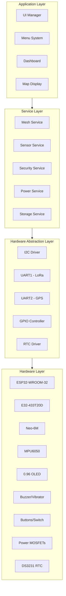
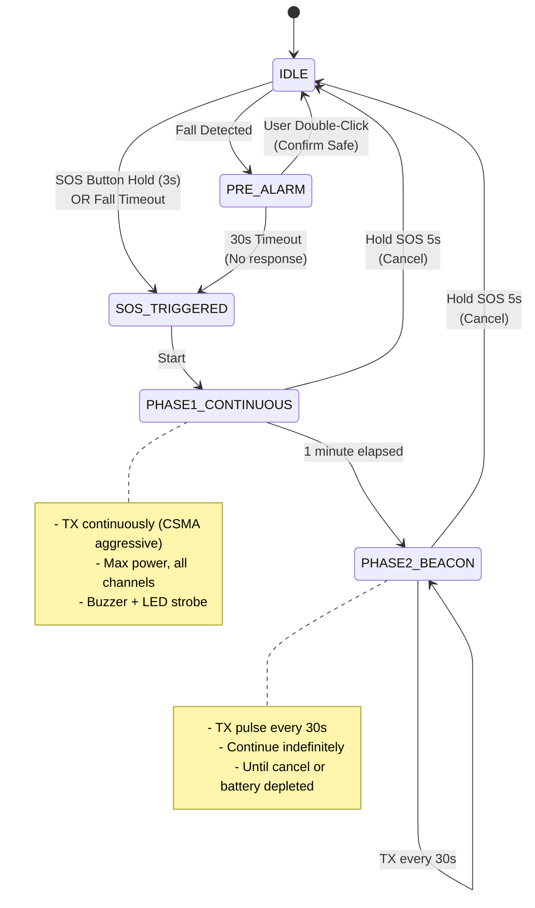
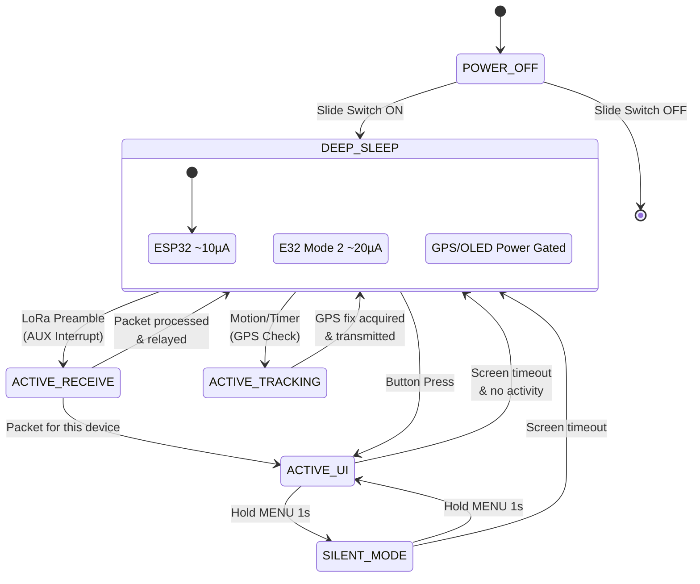
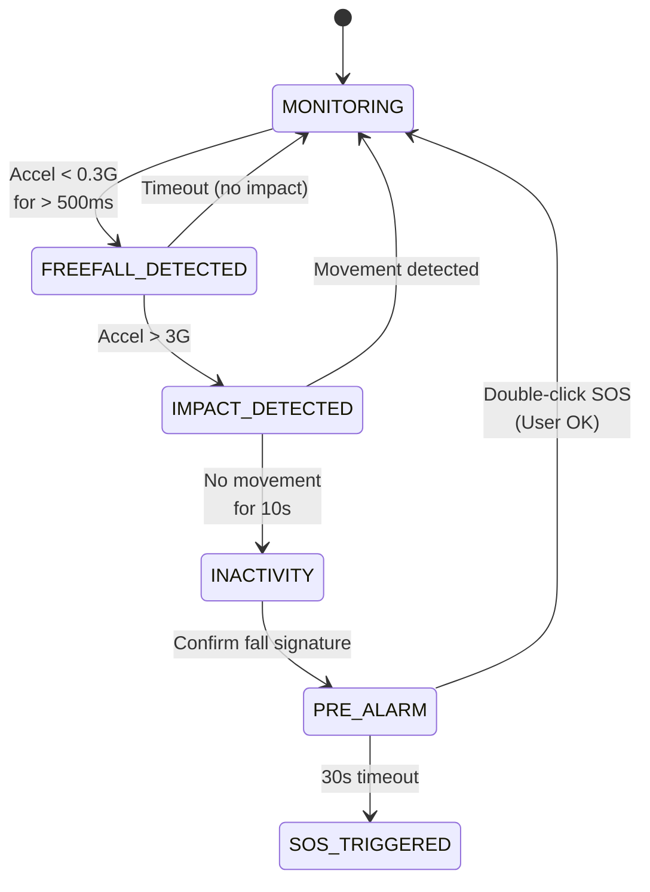

# TrekLink MVP Design Document

> **Project Code:** EXE101-G1-TREKLINK  
> **Version:** 1.2 (Technical Design - Consolidated)  
> **Date:** January 28, 2026  
> **Status:** ENGINEERING APPROVED

---

## 1. Overview

TrekLink is a decentralized, off-grid communication device powered by an **ESP32** (host MCU) and **Ebyte E32-433T20D** (LoRa transceiver). It creates a self-healing mesh network for short-text messaging, GPS tracking, and SOS alerts without reliance on external infrastructure.

The design prioritizes:
- **Redundancy**: Managed Flooding mesh with Forward Error Correction (FEC)
- **Power Efficiency**: Power Gated Architecture with Wake-on-Radio
- **Security**: AES-128-GCM encryption + Pseudo-Random Frequency Hopping (PRFH)
- **Resilience**: Adaptive Power Control, anti-jamming, and dead reckoning fallback

---

## 2. System Architecture

The system follows a **Layered Architecture** with clear separation of concerns:

### 2.1 Architecture Layers



### 2.2 Layer Descriptions

| Layer | Components | Responsibility |
|-------|------------|----------------|
| **Hardware** | ESP32, LoRa, GPS, IMU, OLED, Power circuits | Physical modules and power management |
| **HAL** | I2C, UART, GPIO, RTC drivers | Hardware abstraction, low-level communication |
| **Services** | Mesh, Sensor, Security, Power, Storage | Business logic, protocol handling, encryption |
| **Application** | UI Manager, Menu, Dashboard, Map | User interaction, display rendering |

### 2.3 ESP32 Dual-Core Allocation

| Core | Tasks | Priority |
|------|-------|----------|
| **Core 0** | LoRa RX/TX, Mesh Protocol, FEC Encoding/Decoding, Encryption | Critical (Real-time) |
| **Core 1** | UI Rendering, Button Handling, GPS Parsing, Fall Detection | Normal |

---

## 3. Hardware Design

### 3.1 Block Diagram

```mermaid
graph TD
    subgraph Power_Subsystem["Power Subsystem"]
        BAT[2x 21700 Li-Ion<br/>10,000mAh] --> TP5100[TP5100 Charger]
        TP5100 -- CHRG Status --> GPIO35[GPIO 35]
        BAT --> BUCK[Mini360 Buck<br/>3.3V/5V]
        BUCK --> ESP32_VCC[ESP32 VCC]
        BAT --> RAIL_LORA[LoRa VCC<br/>Always On]
        BAT --> RAIL_GPS_BCKP[GPS V_BCKP<br/>Always On - Hot Start]
        BAT --> RAIL_IMU[MPU6050 VCC<br/>Always On - Low Power Mode]
        BAT --> MOSFET_GATE[AO3401 P-MOSFET<br/>High-Side Switch]
        MOSFET_GATE --> GPS_MAIN_VCC[GPS Main VCC]
        MOSFET_GATE --> OLED_VCC[OLED VCC]
    end

    subgraph MCU_ESP32["ESP32-WROOM-32"]
        ESP32[ESP32 MCU]
        ESP32 -- UART1 TX/RX --> LORA[E32-433T20D<br/>LoRa Module]
        ESP32 -- UART2 RX --> GPS[Neo-6M GPS]
        ESP32 -- I2C --> OLED[0.96 OLED<br/>128x64]
        ESP32 -- I2C --> IMU[MPU6050<br/>Accelerometer/Gyro]
        ESP32 -- GPIO --> BTN[Buttons x4]
        ESP32 -- GPIO --> SW[Slide Switch]
        ESP32 -- GPIO 13 --> MOSFET_CTRL[MOSFET Gate Control]
        ESP32 -- GPIO 27 RTC_GPIO <-- LORA_AUX[LoRa AUX<br/>Wake Interrupt]
        ESP32 -- GPIO 34 RTC_GPIO <-- IMU_INT[MPU6050 INT<br/>Wake Detection]
        ESP32 -- GPIO 12 --> BUZZER_OUT[Buzzer 5V]
        ESP32 -- GPIO 15 --> VIBRATE_OUT[Vibrator]
    end
```

### 3.2 Pinout Specification

| Component | Signal | GPIO | Notes |
|-----------|--------|------|-------|
| **LoRa (E32)** | TX | GPIO 17 | ESP32 RX |
| | RX | GPIO 16 | ESP32 TX |
| | AUX | GPIO 27 | RTC_GPIO (Wake interrupt) |
| | M0 | GPIO 18 | Mode control |
| | M1 | GPIO 19 | Mode control |
| **GPS (Neo-6M)** | TX | GPIO 14 | ESP32 RX (UART2) |
| | V_BCKP | V_BAT | Direct connection for Hot Start |
| **I2C Bus** | SDA | GPIO 21 | Shared: OLED, MPU6050 |
| | SCL | GPIO 22 | Shared: OLED, MPU6050 |
| **MPU6050** | INT | GPIO 34 | Input Only (Fall detection wake) |
| **TP5100** | CHRG | GPIO 35 | Input Only (LOW = Charging) |
| **Power** | MOSFET Gate | GPIO 13 | Via NPN transistor |
| **Audio/Haptic** | Buzzer | GPIO 12 | Active Buzzer 5V |
| | Vibrator | GPIO 15 | Coin motor |
| **Buttons** | MENU | GPIO 25 | Side button |
| | SOS | GPIO 26 | Front, red bar |
| | UP | GPIO 32 | Navigation |
| | DOWN | GPIO 33 | Navigation |
| **Switch** | SLIDE | GPIO 4 | Power ON/OFF |

### 3.3 Power Gating Circuit

```
Battery (+4.2V)
    │
    ├───[AO3401 P-MOSFET Source]
    │           │
    │       [Drain]──────┬───> GPS Main VCC
    │           │        └───> OLED VCC
    │       [Gate]
    │           │
    │       [10kΩ Pull-up to Battery]
    │           │
    └───[1kΩ]───┤
                │
           [2N3904 NPN Collector]
                │
           [Emitter]───> GND
                │
           [Base]───[1kΩ]───> GPIO 13 (ESP32)
```

**Logic:**
- GPIO 13 HIGH → NPN ON → Gate pulled LOW → MOSFET ON → Peripherals powered
- GPIO 13 LOW/Sleep → NPN OFF → Gate pulled HIGH → MOSFET OFF → Peripherals unpowered

### 3.4 GPS Hot Start Strategy

- **V_BCKP** connected directly to battery (always powered)
- **Main VCC** controlled via MOSFET (power gated)
- **Result**: GPS module retains satellite almanac data during sleep, achieving <1 second Time-to-First-Fix (TTFF) on wake

### 3.5 IMU Power Strategy

- **VCC** connected to always-on rail (not power gated)
- **Mode**: Configured to "Low Power Accelerometer Cycle Mode" (~10-20µA)
- **INT Pin**: Wakes ESP32 on motion detection (or timer-based GPS checks for MVP simplicity)

### 3.6 Breadboard Prototype Wiring

This section provides detailed wiring instructions for the breadboard development phase using through-hole modules as specified in `BOM_Development.md`.

#### 3.6.1 Power Distribution Breadboard

```
2x 21700 Battery Holder (Parallel)
        │
        ├──[+]───┬───> TP5100 IN+
        │        ├───> BMS IN+ (if used)
        │        ├───> IRF9540 Source (x3 for GPS/OLED/spare)
        │        └───> 10kΩ Pull-up to MOSFET Gates
        │
        └──[-]───┴───> Common GND (breadboard negative rail)

TP5100 OUT+ ────> Mini360 IN+
TP5100 OUT- ────> GND

Mini360 OUT+ (3.3V) ───┬───> ESP32 VIN (or 3.3V pin)
                        ├───> LoRa E32 VCC
                        ├───> MPU6050 VCC
                        ├───> OLED VCC (via MOSFET drain)
                        ├───> Neo-6M VCC (via MOSFET drain)
                        └───> Breadboard positive rail (3.3V)

Mini360 OUT- ───────────> Common GND
```

**Notes:**
- Use **470µF capacitor** at TP5100 output for stability
- Use **100µF capacitor** at Mini360 output
- Connect **100nF ceramic capacitors** at each module VCC pin
- Adjust Mini360 potentiometer to exactly **3.3V** before connecting modules

#### 3.6.2 ESP32 DevKit Connections

**ESP32 30-pin DevKit V1 Module to Breadboard:**

| ESP32 Pin | Module | Signal | Wire Color (suggestion) |
|-----------|--------|--------|------------------------|
| **3.3V** | Power | Power rail | Red |
| **GND** | Power | Ground rail | Black |
| **GPIO 17** | LoRa E32 | TX (ESP32 TX2) | Orange |
| **GPIO 16** | LoRa E32 | RX (ESP32 RX2) | Yellow |
| **GPIO 27** | LoRa E32 | AUX (Wake interrupt) | Purple |
| **GPIO 18** | LoRa E32 | M0 (Mode control) | Blue |
| **GPIO 19** | LoRa E32 | M1 (Mode control) | Green |
| **GPIO 14** | Neo-6M GPS | TX (ESP32 RX) | Brown |
| **GPIO 21** | I2C Bus | SDA | White |
| **GPIO 22** | I2C Bus | SCL | Gray |
| **GPIO 34** | MPU6050 | INT (Input Only) | Light Blue |
| **GPIO 35** | TP5100 | CHRG Status (Input Only) | Pink |
| **GPIO 13** | MOSFET Gate | Control (via NPN transistor) | Violet |
| **GPIO 12** | Buzzer | Active buzzer control | Cyan |
| **GPIO 15** | Vibrator | Motor control (via 2N2222) | Magenta |
| **GPIO 25** | Button | MENU button | Dark Blue |
| **GPIO 26** | Button | SOS button | Dark Red |
| **GPIO 32** | Button | UP button | Dark Green |
| **GPIO 33** | Button | DOWN button | Dark Yellow |
| **GPIO 4** | Switch | SLIDE ON/OFF | Dark Orange |

#### 3.6.3 LoRa E32 Module Wiring

**Ebyte E32-433T20D Module (7-pin breakout):**

| E32 Pin | ESP32 GPIO | Notes |
|---------|------------|-------|
| VCC | 3.3V rail | **NOT 5V!** E32 is 3.3V logic |
| GND | GND rail | |
| RXD | GPIO 17 | ESP32 TX → E32 RX |
| TXD | GPIO 16 | E32 TX → ESP32 RX |
| AUX | GPIO 27 | Wake-on-Radio interrupt (pull-up 10kΩ internally) |
| M0 | GPIO 18 | Mode control |
| M1 | GPIO 19 | Mode control |
| ANT | SMA connector | 17.5cm 433MHz whip antenna |

**Mode Selection Truth Table:**
| M1 | M0 | Mode |
|----|-----|------|
| 0 | 0 | Normal (TX/RX) |
| 0 | 1 | Wake-Up (power saving listen) |
| 1 | 0 | Power Saving (deep sleep) |
| 1 | 1 | Configuration Mode |

#### 3.6.4 I2C Bus Wiring (Shared Bus)

**All I2C devices connect to the same SDA/SCL lines with pull-ups:**

```
ESP32 GPIO 21 (SDA) ───[4.7kΩ to 3.3V]───┬───> OLED SDA
                                          └───> MPU6050 SDA

ESP32 GPIO 22 (SCL) ───[4.7kΩ to 3.3V]───┬───> OLED SCL
                                          └───> MPU6050 SCL
```

**I2C Addresses (7-bit):**
- **OLED SSD1306**: 0x3C (default)
- **MPU6050**: 0x68 (default, AD0 = GND)

**No Address Conflict:** With DS3231 removed, no conflicts exist on the I2C bus.

#### 3.6.5 GPS Neo-6M Wiring

| Neo-6M Pin | Connection | Notes |
|------------|------------|-------|
| VCC | MOSFET Drain (power gated) | 3.3V when enabled |
| GND | GND rail | |
| TX | ESP32 GPIO 14 (RX) | NMEA data output |
| RX | Not connected | No commands needed for MVP |
| V_BCKP | Battery (+) | **Direct to battery for hot start!** |
| PPS | Not connected | Pulse-per-second (optional) |

**GPS Antenna:**
- 25mm square ceramic patch with IPEX connector
- Max 30mm wire length from module
- Mount on top of enclosure for clear sky view

#### 3.6.6 Power Gating Circuit (Breadboard Assembly)


**For GPS Power Gating (using IRF9530N TO-220 P-MOSFET + S8050-D):**

```
Battery (+4.2V)
    │
    ├─── IRF9530N [Source Pin] (Right pin, facing flat side)
    │           │
    │       [Drain Pin] (Center) ──> Neo-6M VCC
    │           │
    │       [Gate Pin] (Left)
    │           │
    │       [10kΩ] Pull-up to Battery (+)
    │           │
    └───[1kΩ]───┤
                │
           S8050-D [Collector]
                │
           [Emitter] ──> GND
                │
           [Base] ──[1kΩ]──> ESP32 GPIO 13

When GPIO 13 = HIGH: NPN ON → Gate LOW → MOSFET ON → GPS powered
When GPIO 13 = LOW:  NPN OFF → Gate HIGH (via 10k pull-up) → MOSFET OFF → GPS unpowered
```

**For OLED Low-Side Switching (Silent Mode Support):**

OLED VCC always connected to 3.3V, GND switched via S8050-D:

```
OLED GND ──> S8050-D [Collector]
                │
           [Emitter] ──> GND
                │
           [Base] ──[1kΩ]──> ESP32 GPIO 23

When GPIO 23 = HIGH: NPN ON → OLED GND connected → Display ON
When GPIO 23 = LOW:  NPN OFF → OLED GND disconnected → Display OFF
```

**Silent Mode Logic:**
- GPS stays ON (GPIO 13 = HIGH)
- OLED turns OFF (GPIO 23 = LOW)
- Only vibration motor provides haptic feedback


#### 3.6.7 Button Wiring (with Pull-down Resistors)

```
Each button:
    [3.3V] ──[Push Button]──┬──> ESP32 GPIO
                             │
                         [10kΩ] Pull-down
                             │
                            GND
```

| Button | GPIO | Function |
|--------|------|----------|
| MENU | GPIO 25 | Click: Menu/Back, Hold 1s: Silent Mode |
| SOS | GPIO 26 | Click: Ping, Hold 3s: SOS, Hold 5s: Cancel |
| UP | GPIO 32 | Navigation |
| DOWN | GPIO 33 | Navigation |

**Slide Switch (SPDT):**
- Center: to ESP32 GPIO 4
- Side 1: to 3.3V (ON position)
- Side 2: to GND (OFF position)
- Add 10kΩ pull-down from GPIO 4 to GND

#### 3.6.8 Audio/Haptic Wiring

**Passive Buzzer (3.3V) - Requires PWM:**
```
3.3V ──[Passive Buzzer]──┬──> ESP32 GPIO 12 (PWM output)
                         │
                        GND
```

**Vibration Motor:**
```
3.3V ──[Vibration Motor]──┬──[2N2222 Collector]
       [1N4001 Flyback Diode (cathode to 3.3V)]
                           │
                      [Emitter] ──> GND
                           │
                      [Base] ──[1kΩ]──> ESP32 GPIO 15
```

**RGB LED (Common Cathode, 5mm):**
```
3.3V ──[220Ω]──[Red LED Anode]──┐
3.3V ──[220Ω]──[Green Anode]────┤──[Common Cathode]──> GND
3.3V ──[220Ω]──[Blue Anode]─────┘

(Or connect anodes to GPIOs for PWM control)
```

#### 3.6.9 Full Breadboard Layout Concept

```
┌─────────────────────────────────────────────────────────────────┐
│  Breadboard 1 (Main - 830 point)                                │
│                                                                  │
│  [+3.3V Rail]════════════════════════════════════════════      │
│                                                                  │
│  [ESP32 DevKit]  [E32 LoRa]  [Neo-6M GPS]  [OLED]              │
│   (30 pins)      (7 pins)     (6 pins)     (4 pins)            │
│                                                                  │
│  [MPU6050]  [Buttons x4]  [IRF9540 circuits]                  │
│   (8 pins)  (4 pins)  (2 pins ea)   (x2 or x3)                 │
│                                                                  │
│  [GND Rail]══════════════════════════════════════════════       │
└─────────────────────────────────────────────────────────────────┘

┌─────────────────────────────────────────────────────────────────┐
│  Breadboard 2 (Power - 400 point)                               │
│                                                                  │
│  [Battery Holder] ──> [TP5100] ──> [Mini360] ──> [To Main BB]  │
│   (2x 21700)        (Charger)     (Buck 3.3V)                   │
│                                                                  │
│  [470µF Cap]         [100µF Cap]   [USB-C Breakout for charging]│
└─────────────────────────────────────────────────────────────────┘
```

### 3.7 Perfboard Prototype Guidelines

**Transition from Breadboard to Perfboard (~70x70mm or stacked smaller boards):**

1. **Component Placement Strategy:**
   - **Layer 1 (Bottom)**: Power distribution, TP5100, Mini360, MOSFETs, battery wiring
   - **Layer 2 (Top)**: ESP32 module, LoRa module, GPS module, OLED, sensors
   - **Vertical Mounting**: Stack boards using 10mm standoffs within 28mm height limit

2. **Perfboard Soldering:**
   - Solder modules using female headers for removability during debugging
   - Bridge connections using solid-core wire on back side of perfboard
   - Use point-to-point wiring for power distribution (avoid long traces)

3. **Mechanical Mounting:**
   - Adhesive mounting for rapid prototype
   - M3 screw holes at corners for premium build

4. **Testing Before Enclosure:**
   - Verify all voltages with multimeter (3.3V rails, battery voltage)
   - Test power gating (GPS/OLED should turn on/off with GPIO 13)
   - Upload blink sketch to ESP32
   - Test LoRa transmission between two devices

### 3.8 Future PCB Design (70x70mm Custom Board)

**PCB Layout Zones (for Phase 2 development):**

```
┌───────────────────────────────────────────────────────┐
│  GPS Antenna (Top Center)                             │
│  ┌─────────────────────────────────────────────┐     │
│  │ [Neo-6M Module Footprint or Bare Chip]      │     │
│  └─────────────────────────────────────────────┘     │
│                                                        │
│  [ESP32-WROOM Module]  [E32-433 Module/SX1278]        │
│  ┌─────────┐            ┌────────────┐   [SMA]       │
│  │         │            │            │   Connector    │
│  │ ESP32   │            │  LoRa RF   │───[Antenna]   │
│  │         │            │            │    17.5cm      │
│  └─────────┘            └────────────┘                │
│                                                        │
│  [OLED Connector]  [MPU6050]                                 │
│   (Pogo pins)                                         │
│                                                        │
│  [Buttons: MENU SOS UP DOWN] (8-12mm height)          │
│  ●  ▬  ▲  ▼                                          │
│                                                        │
│  [Power Section - Bottom Left]                        │
│  ┌──────────────────────────────────┐                │
│  │ TP5100 → LDO/Buck → MOSFETs      │                │
│  │ (or integrated BMS + regulator)  │                │
│  └──────────────────────────────────┘                │
│                                                        │
│  Battery Connector (JST-PH or solder pads)            │
│  USB-C (Right) | USB Serial (Left)                    │
└───────────────────────────────────────────────────────┘
```

**PCB Layout Guidelines:**

1. **Ground Plane**: Solid copper pour on bottom layer (Layer 2)
2. **Power Routing**: Star topology from battery → regulator → modules (wide traces, 1mm+)
3. **RF Considerations**:
   - Keep LoRa RF section (E32/SX1278) isolated from digital sections
   - Use ground plane under ESP32 antenna area (if using internal antenna)
   - 50Ω trace for SMA antenna connection (calculate width for 2-layer FR4)
4. **Decoupling**:
   - 100nF ceramic capacitor at each IC VCC pin (as close as possible)
   - 10µF tantalum at ESP32 and LoRa modules
   - Bulk electrolytic (470µF) at battery input
5. **MOSFETs Placement**: Near battery connector to minimize power trace length
6. **Button Placement**: Top edge, aligned with enclosure holes

**Future PCB Manufacturing:**
- **Fab Service**: JLCPCB assembly service (SMD pre-solder) or ThegioiIC for quick turnaround
- **Panelization**: 70x70mm single board or panelize from 100x100mm PCB
- **Layers**: 2-layer FR4 (1.6mm thickness)
- **Surface Finish**: ENIG (gold) for reliability in outdoor/humid conditions

---

## 4. Software Design

### 4.1 Component Interfaces

#### 4.1.1 Mesh Service

```cpp
class MeshService {
public:
    void init();
    void processIncoming(Packet& packet);
    void sendMessage(MessageType type, uint8_t targetId, const uint8_t* payload, size_t len);
    void sendSOS();
    void sendPing();
    void requestMatrixUpdate();
    
    // Managed Flooding
    bool isDuplicate(uint8_t msgId);
    void addToSeenBuffer(uint8_t msgId);
    void rebroadcast(Packet& packet);
    
    // PRFH
    uint8_t calculateCurrentChannel();
    void hopToNextChannel();
    void enterSearchMode();
    
private:
    SeenBuffer seenBuffer;
    uint8_t currentChannel;
    RebroadcastMode rebroadcastMode;
    PRFHState prfhState;
};
```

#### 4.1.2 Security Service

```cpp
class SecurityService {
public:
    void init(const uint8_t* preSharedKey);
    
    // Encryption
    bool encrypt(const uint8_t* plaintext, size_t len, uint8_t* ciphertext, uint8_t* tag);
    bool decrypt(const uint8_t* ciphertext, size_t len, const uint8_t* tag, uint8_t* plaintext);
    
    // Header Obfuscation
    uint16_t obfuscateId(uint8_t id, uint8_t prfhIndex);
    uint8_t deobfuscateId(uint16_t obfuscatedId, uint8_t prfhIndex);
    
private:
    uint8_t aesKey[16];
    uint8_t prfhSeed[16];
    LCGState lcgState;
};
```

#### 4.1.3 Sensor Service

```cpp
class SensorService {
public:
    void init();
    
    // GPS
    bool acquireFix(uint32_t timeoutMs);
    GPSData getLastFix();
    bool hasValidFix();
    
    // Fall Detection
    void enableFallDetection();
    void disableFallDetection();
    FallState checkFallSignature();
    
    // Dead Reckoning
    Position estimatePosition();
    
private:
    GPSData lastValidFix;
    MPU6050Handler imu;
    uint32_t lastFixTimestamp;
};
```

#### 4.1.4 Power Service

```cpp
class PowerService {
public:
    void init();
    
    // Power Gating
    void enablePeripherals();
    void disablePeripherals();
    void enableGPS();
    void disableGPS();
    void enableOLED();
    void disableOLED();
    
    // Sleep Management
    void enterDeepSleep(uint32_t wakeIntervalMs);
    void configureWakeOnRadio();
    void configureWakeOnMotion();
    
    // Battery
    uint8_t getBatteryLevel();
    bool isCharging();
    
    // Modes
    void enterSilentMode();
    void exitSilentMode();
    bool isSilentMode();
    
private:
    PowerState powerState;
    bool silentMode;
};
```

#### 4.1.5 Storage Service

```cpp
class StorageService {
public:
    void init();
    
    // Message Logs (Ring Buffer)
    void logMessage(const Message& msg);
    Message getLogEntry(size_t index);
    size_t getLogCount();
    void flushToFlash();
    
    // Settings
    void saveSettings(const DeviceSettings& settings);
    DeviceSettings loadSettings();
    
    // Presets
    const char* getPresetMessage(uint8_t index);
    void setPresetMessage(uint8_t index, const char* message);
    
private:
    RingBuffer<Message> logBuffer;
    NVSHandle nvsHandle;
};
```

### 4.2 Data Models

#### 4.2.1 Packet Structure

```cpp
// Total: <50 bytes for airtime optimization
struct Packet {
    uint8_t header;         // Byte 0: Magic byte (0xTL)
    uint8_t config;         // Byte 1: Bitmask [Encrypted|AckReq|Priority(2)|Reserved(4)]
    uint8_t senderId;       // Byte 2: Unique device ID (or obfuscated)
    uint8_t targetId;       // Byte 3: Target ID (0xFF = Broadcast)
    uint8_t msgId;          // Byte 4: Random nonce for deduplication
    uint8_t hopCount;       // Byte 5: TTL (Time-to-Live)
    uint8_t type;           // Byte 6: Message type enum
    int32_t latitude;       // Bytes 7-10: Encoded lat * 1e6
    int32_t longitude;      // Bytes 11-14: Encoded lon * 1e6
    uint8_t telemetry;      // Byte 15: Battery (4-bit) | RSSI (4-bit)
    uint8_t payload[32];    // Bytes 16-47: Variable payload
    uint8_t crc;            // Byte 48: CRC-8 checksum
};

// Priority levels
enum Priority : uint8_t {
    PRIORITY_LOW = 0,
    PRIORITY_NORMAL = 1,
    PRIORITY_HIGH = 2,
    PRIORITY_SOS = 3
};

// Message types
enum MessageType : uint8_t {
    MSG_TEXT = 0x01,
    MSG_PING = 0x02,
    MSG_SOS = 0x03,
    MSG_ACK = 0x04,
    MSG_MATRIX_REQ = 0x05,
    MSG_MATRIX_RESP = 0x06
};
```

#### 4.2.2 Device Configuration

```cpp
struct DeviceSettings {
    uint8_t deviceId;
    uint8_t channelId;
    uint8_t hopLimit;
    RebroadcastMode rebroadcastMode;
    uint16_t gpsIntervalSec;
    uint8_t screenTimeoutSec;
    bool ledEnabled;
    bool locationBroadcast;
    LocationPrecision locationPrecision;
    uint8_t preSharedKey[16];
};

enum RebroadcastMode : uint8_t {
    REBROADCAST_LOCAL = 0,
    REBROADCAST_ALL = 1
};

enum LocationPrecision : uint8_t {
    PRECISION_OFF = 0,
    PRECISION_LOW = 1,    // ~1km accuracy
    PRECISION_MEDIUM = 2, // ~100m accuracy
    PRECISION_HIGH = 3    // Full precision
};
```

### 4.3 Key State Machines

#### 4.3.1 SOS State Machine



#### 4.3.2 Power State Machine



#### 4.3.3 Fall Detection State Machine



### 4.4 Core Algorithms

#### 4.4.1 Managed Flooding Algorithm

```cpp
void MeshService::processIncoming(Packet& packet) {
    // Step 1: Check if already seen (deduplication)
    if (isDuplicate(packet.msgId)) {
        return; // Drop duplicate
    }
    addToSeenBuffer(packet.msgId);
    
    // Step 2: Decrypt and validate
    if (!securityService.decrypt(packet)) {
        return; // CRC mismatch or decryption failure
    }
    
    // Step 3: Link Quality Check (ETX)
    int linkScore = packet.rssi + (packet.snr * SNR_FACTOR);
    if (linkScore < LINK_QUALITY_THRESHOLD) {
        return; // Signal too weak, likely to fail
    }
    
    // Step 4: Process locally if for this device
    if (packet.targetId == deviceId || packet.targetId == BROADCAST_ID) {
        handleMessage(packet);
    }
    
    // Step 5: Rebroadcast decision
    if (packet.hopCount > 0) {
        if (rebroadcastMode == REBROADCAST_ALL ||
            (rebroadcastMode == REBROADCAST_LOCAL && packet.channelId == currentChannel)) {
            packet.hopCount--;
            rebroadcast(packet);
        }
    }
}

void MeshService::rebroadcast(Packet& packet) {
    // Random delay for CSMA collision avoidance
    uint32_t csmaDelay = random(10, 100); // 10-100ms
    delay(csmaDelay);
    
    loraService.transmit(packet);
}
```

#### 4.4.2 Pseudo-Random Frequency Hopping (PRFH)

```cpp
// Linear Congruential Generator for channel hopping
uint8_t SecurityService::calculateCurrentChannel() {
    // Get current time slot
    uint32_t unixTime = rtcService.getUnixTimestamp();
    uint32_t hopIndex = unixTime / HOP_INTERVAL_MS;
    
    // LCG formula: X(n+1) = (a * X(n) + c) mod m
    // Seed from pre-shared key
    uint32_t seed = *(uint32_t*)prfhSeed;
    uint32_t lcgState = seed;
    
    for (uint32_t i = 0; i < hopIndex; i++) {
        lcgState = (LCG_MULTIPLIER * lcgState + LCG_INCREMENT) % LCG_MODULUS;
    }
    
    // Map to 32 available channels (410-441 MHz)
    return lcgState % 32;
}

float LoRaService::getFrequencyForChannel(uint8_t channel) {
    // Base frequency + channel offset
    return BASE_FREQ_MHZ + (channel * CHANNEL_STEP_MHZ);
    // E.g., 410.0 + (5 * 1.0) = 415.0 MHz
}
```

#### 4.4.3 Reed-Solomon Forward Error Correction

```cpp
// Using RS(255, 223) - can correct up to 16 byte errors
class FECService {
    ReedSolomon<255, 223> rs;
    
public:
    void encode(uint8_t* data, size_t dataLen, uint8_t* encoded) {
        // Add 32 bytes of parity data
        rs.encode(data, dataLen, encoded);
    }
    
    bool decode(uint8_t* received, size_t len, uint8_t* decoded) {
        int errors = rs.decode(received, len, decoded);
        if (errors < 0) {
            return false; // Uncorrectable
        }
        // Log number of corrected errors for diagnostics
        return true;
    }
};
```

#### 4.4.4 Haversine Distance Calculation

```cpp
float calculateDistance(float lat1, float lon1, float lat2, float lon2) {
    const float R = 6371000; // Earth radius in meters
    
    float dLat = radians(lat2 - lat1);
    float dLon = radians(lon2 - lon1);
    
    float a = sin(dLat/2) * sin(dLat/2) +
              cos(radians(lat1)) * cos(radians(lat2)) *
              sin(dLon/2) * sin(dLon/2);
    
    float c = 2 * atan2(sqrt(a), sqrt(1-a));
    
    return R * c; // Distance in meters
}

float calculateBearing(float lat1, float lon1, float lat2, float lon2) {
    float dLon = radians(lon2 - lon1);
    
    float x = sin(dLon) * cos(radians(lat2));
    float y = cos(radians(lat1)) * sin(radians(lat2)) -
              sin(radians(lat1)) * cos(radians(lat2)) * cos(dLon);
    
    float bearing = atan2(x, y);
    return fmod((degrees(bearing) + 360), 360); // Normalize to 0-360
}
```

#### 4.4.5 Dead Reckoning Fallback

```cpp
Position SensorService::estimatePosition() {
    if (hasValidFix() && (millis() - lastFixTimestamp < DEAD_RECKONING_TIMEOUT)) {
        return lastValidFix;
    }
    
    // Use MPU6050 data for estimation
    float heading = imu.getCompassHeading();
    float estimatedSpeed = imu.getEstimatedSpeed(); // From step detection
    uint32_t timeDelta = millis() - lastFixTimestamp;
    
    float distance = estimatedSpeed * (timeDelta / 1000.0);
    
    // Calculate new position
    Position estimated;
    estimated.latitude = lastValidFix.latitude + 
        (distance * cos(radians(heading))) / 111320; // meters to degrees
    estimated.longitude = lastValidFix.longitude +
        (distance * sin(radians(heading))) / (111320 * cos(radians(lastValidFix.latitude)));
    estimated.isEstimated = true;
    
    return estimated;
}
```

### 4.5 LoRa Module Control

#### 4.5.1 E32 Mode Configuration

| M1 | M0 | Mode | Description | Current |
|----|-----|------|-------------|---------|
| 0 | 0 | Normal | TX/RX enabled | ~50mA active |
| 0 | 1 | Wake-Up | Preamble listening | ~20µA |
| 1 | 0 | Power Saving | Low power listen | ~2µA |
| 1 | 1 | Sleep/Config | Configuration mode | ~5µA |

#### 4.5.2 Rapid Channel Switching

```cpp
void LoRaService::switchChannel(uint8_t newChannel) {
    // Step 1: Enter config mode
    digitalWrite(M0_PIN, HIGH);
    digitalWrite(M1_PIN, HIGH);
    delay(5); // Mode transition delay
    
    // Step 2: Send channel change command
    uint8_t cmd[6] = {0xC0, 0x00, ADDR_H, ADDR_L, 0x1A, newChannel};
    loraSerial.write(cmd, 6);
    delay(40); // E32 internal MCU settling time (optimized)
    
    // Step 3: Return to normal mode
    digitalWrite(M0_PIN, LOW);
    digitalWrite(M1_PIN, LOW);
    delay(5); // Mode transition delay
    
    currentChannel = newChannel;
}
```

### 4.6 Software Interference Mitigation

**Issue**: Top-mounted GPS and LoRa antennas (~7cm separation) may cause GPS LNA saturation during TX burst (100-500ms).

**Solution**: During LoRa transmission, the system SHALL ignore/discard GPS NMEA data. GPS reading resumes immediately after TX completes.

```cpp
void LoRaService::transmit(Packet& packet) {
    sensorService.pauseGPSParsing();
    
    // Perform transmission
    loraSerial.write(packet.data, packet.length);
    waitForTransmitComplete();
    
    sensorService.resumeGPSParsing();
}
```

---

## 5. UI Design

### 5.1 Screen Layouts

#### 5.1.1 Main Dashboard (128x64 OLED)

```
┌────────────────────────────────┐
│ [▁▃▅] N:03      [████] 85%     │  <- Signal, Nodes, Battery
├────────────────────────────────┤
│ < "Moving North" from ID:02    │  <- Last message
│ ! SOS from ID:05 - 200m NE     │  <- Urgent (blinking)
│                                │
├────────────────────────────────┤
│ Util:12%  GPS:3D  12:00 PM     │  <- Airtime, GPS, Clock
└────────────────────────────────┘
```

#### 5.1.2 Map Screen (Dot Matrix)

```
┌────────────────────────────────┐
│         N                      │
│      .                         │  <- Node ID:03
│   .     ◉                      │  <- Self at center
│            .                   │  <- Node ID:05
│         S                      │
├────────────────────────────────┤
│ ID:05 | 150m | NE | RSSI:-72   │  <- Selected node info
└────────────────────────────────┘
```

#### 5.1.3 Menu Structure

```
├── Ping Location
├── Send Message
│   ├── "Safe"
│   ├── "Help"
│   ├── "Wait"
│   ├── "Lost"
│   ├── "Moving North"
│   ├── "Moving South"
│   ├── "Stop"
│   └── "Come to Me"
├── Logs
│   ├── View Received
│   └── View Sent
├── Map & Coord
│   ├── Radar View
│   └── Raw GPS Data
├── Device Settings
│   ├── Set Channel ID
│   └── Set Device ID
└── System Settings
    ├── LoRa Config
    │   ├── Frequency
    │   ├── Baud Rate
    │   ├── TX Power
    │   └── Hop Limit
    ├── Rebroadcast Mode
    │   ├── All
    │   └── Local Only
    ├── Power Settings
    │   ├── GPS Interval
    │   ├── Screen Timeout
    │   └── LED On/Off
    ├── Wireless (Placeholder)
    │   ├── Bluetooth
    │   └── WiFi AP
    └── Location Broadcast
        ├── Precision (High/Med/Low/Off)
        └── Interval
```

---

## 6. Error Handling

### 6.1 Error Categories

| Category | Examples | Handling Strategy |
|----------|----------|-------------------|
| **Communication** | TX failure, no ACK, channel busy | Retry with backoff, CSMA |
| **Sensor** | GPS timeout, IMU failure | Fallback to dead reckoning, log error |
| **Power** | Low battery, charging issue | Display warning, reduce functionality |
| **Storage** | NVS write failure | Use RAM buffer, retry on next cycle |
| **Security** | Decryption failure, invalid packet | Silent discard, log for diagnostics |

### 6.2 Logging Approach

- **RAM Buffer**: Primary storage for recent events
- **Flash Write**: Only on buffer full or critical events (SOS)
- **Log Levels**: DEBUG, INFO, WARN, ERROR, CRITICAL
- **Rotation**: Circular buffer, oldest entries overwritten

---

## 7. Testing Strategy

### 7.1 Unit Testing

| Component | Test Focus |
|-----------|------------|
| SecurityService | AES encryption/decryption round-trip, PRFH sequence validation |
| MeshService | Duplicate detection, hop count decrement, rebroadcast logic |
| SensorService | GPS parsing, fall detection signature, distance calculation |
| StorageService | Ring buffer operations, NVS read/write |

### 7.2 Integration Testing

- **LoRa Communication**: Multi-node message relay, ACK handling
- **Power Transitions**: Sleep/wake cycles, peripheral power gating
- **UI Responsiveness**: Button debouncing, menu navigation, screen updates

### 7.3 Wokwi Simulation Strategy

1. **Mesh Logic**: Mock UART interface to simulate packet reception
2. **UI Flows**: OLED display logic and button debouncing
3. **Sensor Protocol**: I2C mocks for MPU6050, UART mocks for NMEA GPS streams
4. **State Machines**: SOS, Power, and Fall Detection state transitions

---

## 8. Development Phases

| Phase | Focus | Deliverables |
|-------|-------|--------------|
| **Phase 1** | HAL & Kernel | Drivers for pinout, Power Gating logic, Sleep/Wake, E32 mode control |
| **Phase 2** | Mesh Core | Blind Flooding, Packet Structure, AES-128-GCM, PRFH, FEC |
| **Phase 3** | Sensor Fusion | GPS Hot Start, Fall Detection interrupts, Dead Reckoning |
| **Phase 4** | UI & Application | Menu system, Presets, SOS State Machine, Dashboard |
| **Phase 5** | Integration & Testing | Full system integration, Wokwi verification, field testing |

---

## 9. Configuration & Environment

### 9.1 Development Environment

- **Platform**: PlatformIO Core (CLI)
- **Framework**: Arduino Framework (ESP32)
- **Language**: C++17
- **Board**: ESP32 DevModule (esp32dev)

### 9.2 Key Libraries

| Library | Purpose |
|---------|---------|
| `Adafruit_SSD1306` | OLED display driver |
| `TinyGPSPlus` | GPS NMEA parsing |
| `MPU6050_light` | IMU interface |
| `AESLib` or `mbedTLS` | AES-128-GCM encryption |
| `RS-FEC` | Reed-Solomon FEC |
| `LoRa_E32` (Mischianti) | E32 module control (modified for fast switching) |

> **Note:** ESP32 internal RTC is used for timekeeping, synchronized with GPS time - no external RTC library needed


### 9.3 PlatformIO Configuration

```ini
[env:esp32dev]
platform = espressif32
board = esp32dev
framework = arduino
monitor_speed = 115200
lib_deps = 
    adafruit/Adafruit SSD1306
    mikalhart/TinyGPSPlus
    rfetick/MPU6050_light
    adafruit/RTClib
```

---

## 10. Conclusion

This design document provides the comprehensive technical blueprint for the TrekLink MVP. It addresses all requirements from the SRS including communication protocols, security measures, power management, and user interface specifications. The modular architecture and clear interfaces enable parallel development across teams while maintaining system integrity.

All engineering efforts must align with this design. Deviations require formal review and approval.
