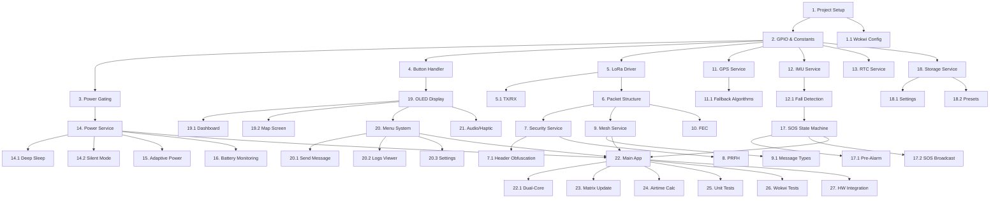

# TrekLink MVP Implementation Plan

> **Project Code:** EXE101-G1-TREKLINK  
> **Version:** 1.2  
> **Date:** January 28, 2026

---

## Implementation Tasks

### Phase 1: Project Setup & HAL (Hardware Abstraction Layer)

- [ ] 1. Initialize PlatformIO project structure
  - Create `platformio.ini` with ESP32 configuration
  - Set up `src/`, `include/`, `lib/`, `test/` directories
  - Configure build flags for C++17
  - Add initial library dependencies (Adafruit_SSD1306, TinyGPSPlus, MPU6050_light, RTClib)
  - _Requirements: REQ-ENV-01, REQ-ENV-02_

- [ ] 1.1 Create Wokwi simulation configuration
  - Create `wokwi.toml` configuration file
  - Create `diagram.json` with ESP32, OLED, buttons, and LED components
  - Map virtual pins to match hardware pinout specification
  - _Requirements: REQ-ENV-03_

- [ ] 2. Implement GPIO pin definitions and hardware constants
  - Create `include/hardware_config.h` with all GPIO pin definitions
  - Define LoRa pins (TX:17, RX:16, AUX:27, M0:18, M1:19)
  - Define sensor pins (I2C SDA:21, SCL:22, MPU_INT:34)
  - Define UI pins (buttons, buzzer:12, vibrator:15, MOSFET:13)
  - _Requirements: REQ-HW-04_

- [ ] 3. Implement Power Gating driver
  - Create `src/hal/power_gate.cpp` and `include/hal/power_gate.h`
  - Implement MOSFET control via GPIO 13
  - Add functions: `enablePeripherals()`, `disablePeripherals()`, `enableGPS()`, `disableGPS()`
  - Test power gating logic with LED indicator
  - _Requirements: REQ-PWR-03.1, REQ-PWR-03.2, REQ-PWR-03.3_

- [ ] 4. Implement Button Handler with debouncing
  - Create `src/hal/button_handler.cpp` and `include/hal/button_handler.h`
  - Implement debounce logic (50ms threshold)
  - Detect click, double-click, and hold events
  - Support MENU, SOS, UP, DOWN buttons
  - _Requirements: REQ-UI-01_

---

### Phase 2: Core Services - Communication & Security

- [ ] 5. Implement LoRa E32 driver
  - Create `src/hal/lora_driver.cpp` and `include/hal/lora_driver.h`
  - Implement UART communication with E32 module
  - Add mode control (Normal, Wake-Up, Power Saving, Config)
  - Implement rapid channel switching with 40ms settling time
  - Add AUX pin interrupt for Wake-on-Radio
  - _Requirements: REQ-COM-01.4, REQ-SEC-02.1_

- [ ] 5.1 Implement LoRa transmission and reception
  - Add `transmit()` and `receive()` methods
  - Implement CSMA collision avoidance with random backoff
  - Add RSSI and SNR reading capability
  - _Requirements: REQ-COM-01.2, REQ-COM-02.5_

- [ ] 6. Implement Packet structure and serialization
  - Create `src/protocol/packet.cpp` and `include/protocol/packet.h`
  - Define Packet struct (<50 bytes: header, config, IDs, msgId, hopCount, type, GPS, telemetry, payload, CRC)
  - Implement `serialize()` and `deserialize()` methods
  - Add CRC-8 calculation and validation
  - _Requirements: REQ-COM-02.1, REQ-COM-02.2_

- [ ] 7. Implement Security Service - AES-128-GCM encryption
  - Create `src/services/security_service.cpp` and `include/services/security_service.h`
  - Integrate mbedTLS or AESLib for encryption
  - Implement `encrypt()` and `decrypt()` with authentication tag
  - Add nonce management using msgId
  - _Requirements: REQ-SEC-01.1, REQ-SEC-01.2, REQ-SEC-01.3_

- [ ] 7.1 Implement header obfuscation
  - Add rotating hash for Sender ID and Target ID obfuscation
  - Implement `obfuscateId()` and `deobfuscateId()` using PRFH index
  - _Requirements: REQ-SEC-01.4_

- [ ] 8. Implement PRFH (Pseudo-Random Frequency Hopping)
  - Add LCG (Linear Congruential Generator) implementation
  - Create `calculateCurrentChannel()` using Unix timestamp and PSK seed
  - Implement `hopToNextChannel()` for channel transitions
  - Add `enterSearchMode()` for lost sync recovery (cycle 32 channels)
  - _Requirements: REQ-SEC-02.1, REQ-SEC-02.2, REQ-SEC-02.3, REQ-SEC-02.4_

- [ ] 9. Implement Mesh Service - Managed Flooding
  - Create `src/services/mesh_service.cpp` and `include/services/mesh_service.h`
  - Implement Seen Buffer for message ID deduplication
  - Add `processIncoming()` with duplicate check, decrypt, link quality check
  - Implement rebroadcast logic with hop count decrement
  - Support Local-Only and All rebroadcast modes
  - _Requirements: REQ-COM-01.1, REQ-COM-01.2, REQ-COM-01.3, REQ-COM-04.1, REQ-COM-04.2_

- [ ] 9.1 Implement message type handling
  - Add handlers for Text, Ping, SOS, ACK, Matrix Request/Response
  - Implement SOS priority queuing (override normal packets)
  - Add ACK generation for direct messages
  - _Requirements: REQ-COM-03.1, REQ-COM-03.2, REQ-COM-03.3, REQ-COM-03.5_

- [ ] 10. Implement Reed-Solomon FEC
  - Integrate RS-FEC library or implement RS(255,223)
  - Create `src/protocol/fec.cpp` and `include/protocol/fec.h`
  - Add `encode()` to add parity bytes before transmission
  - Add `decode()` to correct errors on reception (up to 16 bytes)
  - _Requirements: REQ-COM-02.3_

---

### Phase 3: Sensor Services

- [ ] 11. Implement GPS Service
  - Create `src/services/gps_service.cpp` and `include/services/gps_service.h`
  - Integrate TinyGPSPlus for NMEA parsing
  - Implement `acquireFix()` with configurable timeout
  - Store last valid fix with timestamp
  - Add GPS pause/resume for TX interference mitigation
  - _Requirements: REQ-NAV-01.1, REQ-NAV-01.2, REQ-NAV-01.3, REQ-NAV-01.4_

- [ ] 11.1 Implement position fallback algorithms
  - Add Haversine distance and bearing calculation
  - Implement dead reckoning using MPU6050 data
  - Add RSSI-based triangulation (placeholder for >2 nodes)
  - _Requirements: REQ-NAV-02.1, REQ-NAV-02.2, REQ-NAV-03.2_

- [ ] 12. Implement IMU Service - MPU6050 driver
  - Create `src/services/imu_service.cpp` and `include/services/imu_service.h`
  - Integrate MPU6050_light library
  - Configure Low Power Accelerometer Cycle Mode
  - Read acceleration, gyroscope, and calculate orientation
  - _Requirements: REQ-HW-01.5_

- [ ] 12.1 Implement Fall Detection algorithm
  - Create fall detection state machine (Monitoring → Freefall → Impact → Inactivity)
  - Detect freefall signature (accel < 0.3G for > 500ms)
  - Detect impact (accel > 3G)
  - Detect inactivity (10 seconds no movement)
  - _Requirements: REQ-SAF-02.1_

- [ ] 13. Implement RTC Service - DS3231 driver
  - Create `src/services/rtc_service.cpp` and `include/services/rtc_service.h`
  - Integrate RTClib for DS3231 communication
  - Implement `getUnixTimestamp()` for PRFH synchronization
  - Add RTC calibration from GPS fix
  - _Requirements: REQ-NAV-01.5, REQ-SEC-02.3_

---

### Phase 4: Power Management

- [ ] 14. Implement Power Service state machine
  - Create `src/services/power_service.cpp` and `include/services/power_service.h`
  - Implement states: POWER_OFF, DEEP_SLEEP, ACTIVE_RECEIVE, ACTIVE_TRACKING, ACTIVE_UI, SILENT_MODE
  - Add state transition logic based on events
  - _Requirements: REQ-PWR-02.1, REQ-PWR-02.2, REQ-PWR-02.3, REQ-PWR-02.4_

- [ ] 14.1 Implement ESP32 Deep Sleep
  - Configure RTC_GPIO wake sources (LoRa AUX, MPU INT, buttons)
  - Implement `enterDeepSleep()` with wake interval
  - Add RTC RAM state preservation
  - _Requirements: REQ-PWR-02.1_

- [ ] 14.2 Implement Silent Mode
  - Add `enterSilentMode()` to disable OLED, LED, Buzzer
  - Keep vibrator active for haptic feedback
  - Implement toggle on MENU hold (1s)
  - _Requirements: REQ-SEC-04.1, REQ-SEC-04.2, REQ-SEC-04.3, REQ-SEC-04.4_

- [ ] 15. Implement Adaptive Power Control (APC)
  - Add RSSI monitoring and power level negotiation
  - Implement power reduction when RSSI > -60dBm
  - Piggyback "Power Down" command in ACK packets
  - Bypass APC for SOS transmissions (max power)
  - _Requirements: REQ-PWR-04.2, REQ-PWR-04.3, REQ-SAF-01.5_

- [ ] 16. Implement Battery monitoring
  - Add ADC reading for battery voltage
  - Implement `getBatteryLevel()` returning 0-100%
  - Add charging detection via TP5100 CHRG pin (GPIO 35)
  - _Requirements: REQ-PWR-01.2_

---

### Phase 5: Safety & SOS

- [ ] 17. Implement SOS State Machine
  - Create `src/services/sos_service.cpp` and `include/services/sos_service.h`
  - Implement states: IDLE, PRE_ALARM, SOS_TRIGGERED, PHASE1_CONTINUOUS, PHASE2_BEACON
  - Handle SOS button: single-click (ping), hold 3s (SOS), hold 5s (cancel)
  - _Requirements: REQ-SAF-01.1, REQ-SAF-01.2, REQ-SAF-01.3, REQ-SAF-01.4_

- [ ] 17.1 Implement Pre-Alarm state for fall detection
  - Trigger 30-second countdown with buzzer and vibration
  - Allow cancellation via double-click SOS button
  - Auto-trigger SOS on timeout
  - _Requirements: REQ-SAF-02.2, REQ-SAF-02.3, REQ-SAF-02.4, REQ-SAF-02.5_

- [ ] 17.2 Implement SOS broadcast routine
  - Phase 1: Continuous TX for 1 minute (aggressive CSMA)
  - Phase 2: Pulsed TX every 30 seconds indefinitely
  - Broadcast to ALL channels, max power, include GPS coordinates
  - Activate buzzer and LED strobe (unless Silent Mode)
  - _Requirements: REQ-SAF-01.3, REQ-COM-03.4_

---

### Phase 6: Storage Service

- [ ] 18. Implement Storage Service
  - Create `src/services/storage_service.cpp` and `include/services/storage_service.h`
  - Initialize NVS (Non-Volatile Storage) partition
  - Implement Ring Buffer for message logs in RAM
  - Add `flushToFlash()` on buffer full or critical events
  - _Requirements: REQ-DAT-01.1, REQ-DAT-01.4_

- [ ] 18.1 Implement settings persistence
  - Save/load DeviceSettings struct to NVS
  - Include deviceId, channelId, hopLimit, rebroadcastMode, GPS interval, presets
  - Reserve 25% storage for configuration
  - _Requirements: REQ-DAT-01.2_

- [ ] 18.2 Implement preset messages
  - Store 8 default preset messages in NVS
  - Implement `getPresetMessage()` and `setPresetMessage()`
  - Default presets: "Safe", "Help", "Wait", "Lost", "Moving North", "Moving South", "Stop", "Come to Me"
  - _Requirements: REQ-DAT-02.1, REQ-DAT-02.2, REQ-DAT-02.3_

---

### Phase 7: User Interface

- [ ] 19. Implement OLED Display driver
  - Create `src/ui/display.cpp` and `include/ui/display.h`
  - Initialize Adafruit_SSD1306 for 128x64 I2C OLED
  - Create drawing utilities for icons, text, graphs
  - Implement double-buffering for flicker-free updates
  - _Requirements: REQ-HW-02.1_

- [ ] 19.1 Implement Dashboard screen
  - Draw top bar: signal strength icon, node count, battery icon and %
  - Draw middle area: scrolling message log (last 3 messages)
  - Draw bottom bar: airtime %, GPS status (2D/3D/---), clock
  - Highlight SOS messages with blinking effect
  - _Requirements: REQ-UI-02.1, REQ-UI-02.2, REQ-UI-02.3_

- [ ] 19.2 Implement Map screen (Dot Matrix)
  - Draw radar-style map with self at center
  - Plot other nodes as dots at relative positions
  - Show distance, direction, and RSSI for selected node
  - Allow node selection with UP/DOWN buttons
  - _Requirements: REQ-NAV-03.1, REQ-NAV-03.2, REQ-NAV-03.3_

- [ ] 20. Implement Menu system
  - Create `src/ui/menu.cpp` and `include/ui/menu.h`
  - Build hierarchical menu structure from specification
  - Handle navigation with MENU (enter/back), UP, DOWN buttons
  - Implement scroll and selection highlighting
  - _Requirements: REQ-UI-03.1, REQ-UI-03.2_

- [ ] 20.1 Implement Send Message screen
  - Display list of preset messages
  - Allow selection and confirmation
  - Broadcast selected message with GPS coordinates
  - _Requirements: REQ-DAT-02.3_

- [ ] 20.2 Implement Logs viewer
  - Display received and sent message logs
  - Show metadata: RSSI, SNR, hop count, timestamp
  - Implement scrolling for long logs
  - _Requirements: REQ-DAT-01.3_

- [ ] 20.3 Implement Settings screens
  - Device Settings: Channel ID, Device ID (editable)
  - System Settings: LoRa config, Rebroadcast mode, Power settings, Wireless placeholders
  - Save changes to NVS on confirmation
  - _Requirements: REQ-UI-03.1_

- [ ] 21. Implement Audio/Haptic feedback
  - Create `src/ui/feedback.cpp` and `include/ui/feedback.h`
  - Implement buzzer patterns: beep, alarm, SOS pattern
  - Implement vibration patterns: short pulse, long pulse, pattern
  - Respect Silent Mode (disable buzzer, keep vibration)
  - _Requirements: REQ-HW-02.2, REQ-HW-02.3, REQ-SEC-04.2_

---

### Phase 8: Integration & Main Application

- [ ] 22. Implement Main Application loop
  - Create `src/main.cpp` with setup() and loop()
  - Initialize all services in correct order
  - Implement main state machine coordinating all subsystems
  - Handle power state transitions based on events
  - _Requirements: All_

- [ ] 22.1 Integrate dual-core task allocation
  - Configure Core 0 for LoRa RX/TX, Mesh, FEC, Encryption (critical)
  - Configure Core 1 for UI, GPS parsing, Fall Detection (normal)
  - Use FreeRTOS tasks with appropriate priorities
  - _Requirements: REQ-HW-01.1_

- [ ] 23. Implement Matrix Update functionality
  - Handle double-click SOS for Location Ping Request
  - Broadcast matrix request to all nodes
  - Collect and process matrix responses
  - Update neighbor list with positions and RSSI
  - _Requirements: REQ-COM-03.4, REQ-NAV-02.3_

- [ ] 24. Implement Airtime calculation
  - Track transmission time and duty cycle
  - Calculate channel utilization percentage
  - Display on dashboard bottom bar
  - _Requirements: REQ-PWR-04.4_

---

### Phase 9: Testing & Verification

- [ ] 25. Create unit tests for core services
  - Test SecurityService: encryption/decryption round-trip, PRFH sequence
  - Test MeshService: duplicate detection, hop decrement, rebroadcast
  - Test Packet: serialization/deserialization, CRC validation
  - Test FEC: error correction capability
  - _Requirements: Testing Strategy_

- [ ] 26. Create Wokwi simulation test scenarios
  - Test button debouncing and event detection
  - Test OLED display rendering
  - Test menu navigation flow
  - Test SOS state machine transitions
  - _Requirements: REQ-ENV-03.1, REQ-ENV-03.2_

- [ ] 27. Create hardware integration tests
  - Test LoRa TX/RX between two nodes
  - Test GPS fix acquisition and parsing
  - Test fall detection with IMU data
  - Test power gating and deep sleep current
  - _Requirements: Integration Testing_

---

## Task Dependencies

---

## Completion Criteria

Each task is considered complete when:
1. Code compiles without errors or warnings
2. Related unit tests pass (where applicable)
3. Functionality verified in Wokwi simulation (where applicable)
4. Requirements referenced in task are satisfied
5. Code follows project coding standards
